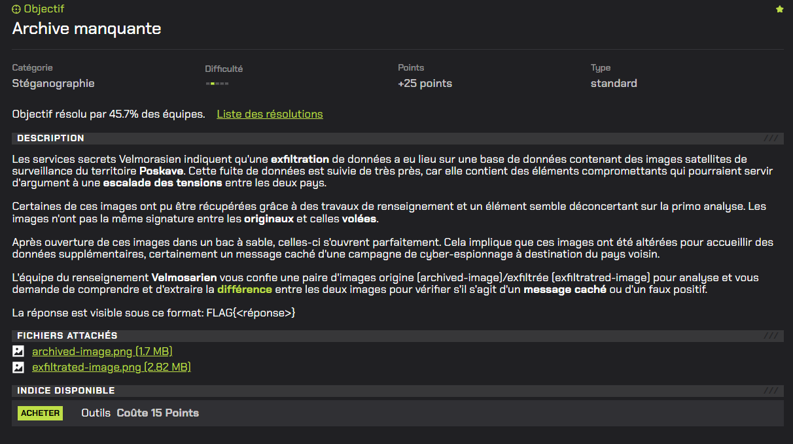
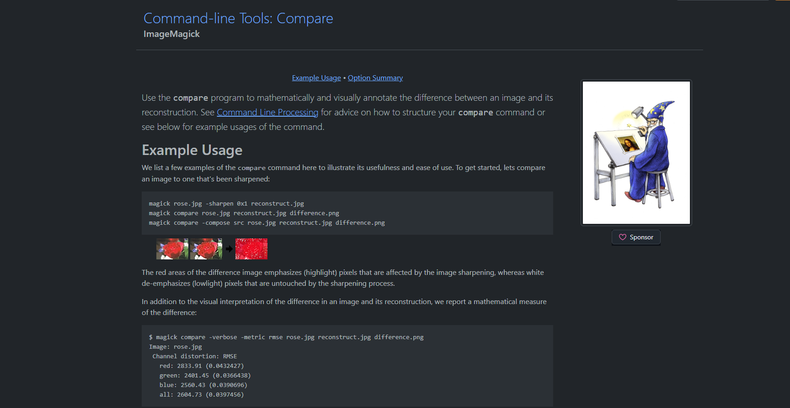
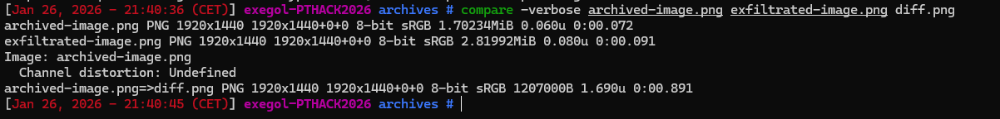
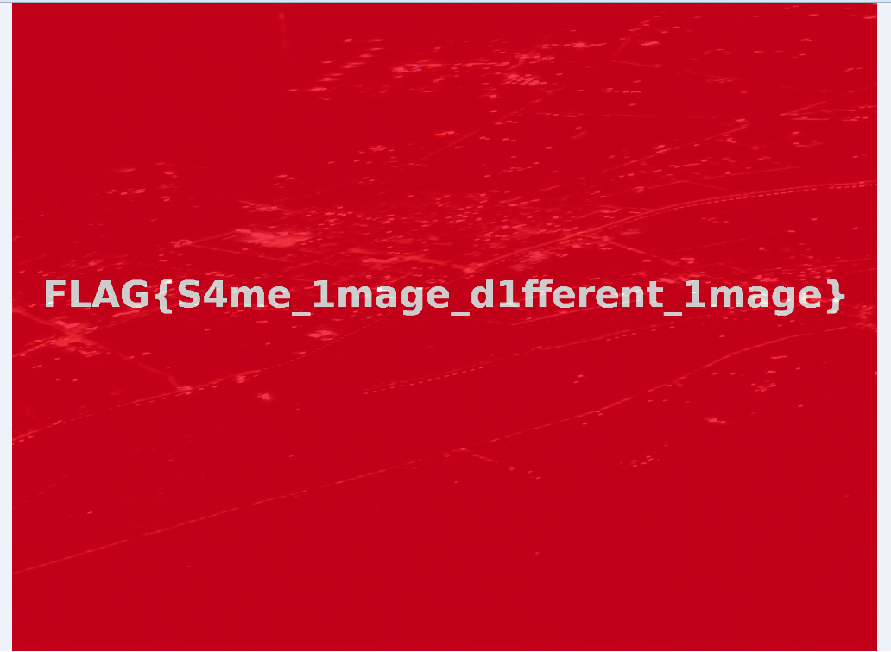

# Archive manquante



# Writeup

Dans ce challenge de stéganographie, nous récupérons deux images satellites : une originale et une exfiltrée.

Notre objectif est donc de comparer les deux fichiers et d’extraire cette différence afin d’obtenir le flag.

Comme nous avons deux images censées être identiques (une originale et une exfiltrée), la méthode la plus logique est de les comparer automatiquement.

Nous pouvons donc utiliser la commande compare d'[ImageMagick](https://imagemagick.org/script/compare.php) qui permet de mettre en évidence les pixels différents entre deux images et de générer une image de différence :





Ceci nous permet de trouver le flag présent dans l'image diff.png :



```
FLAG{S4me_1mage_d1fferent_1mage}
```