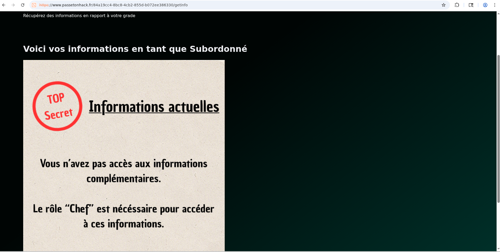
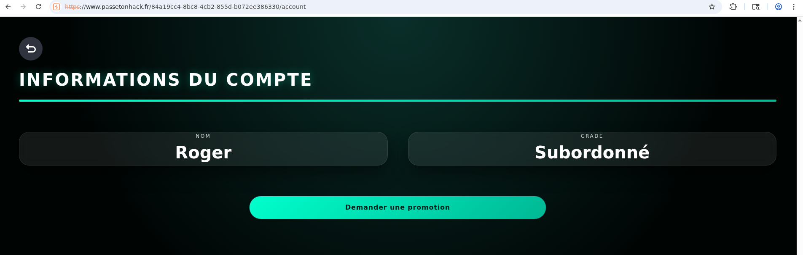
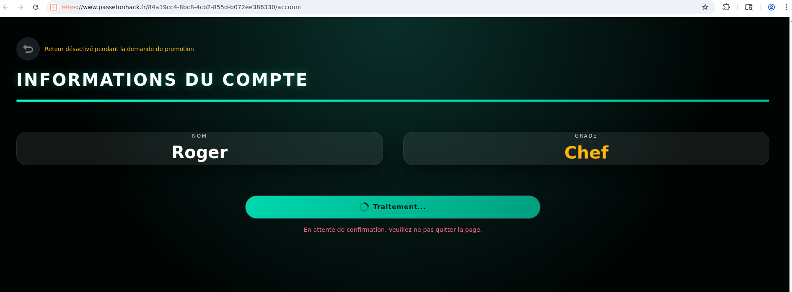
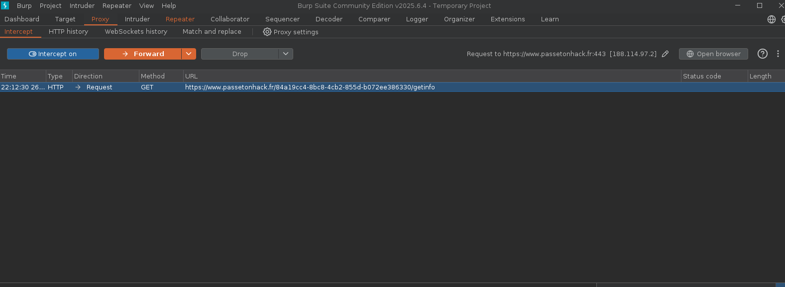
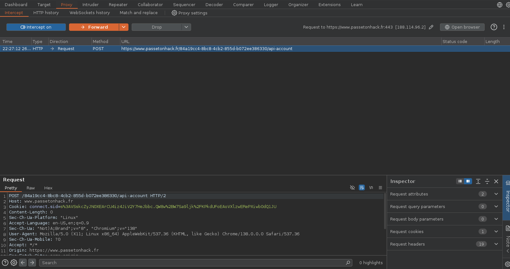
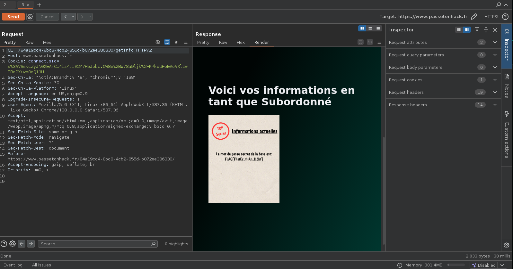

# Compétition sur la toile


# Writeup

Dans ce challenge, nous avons accès à une page web de login sur laquelle nous pouvons nous connecter grâce aux credentials :

```
Nom d'utilisateur : Roger

Mot de passe : password
```

Après connection nous pouvons nous rendre sur deux pages :





`/account`et `/getinfo`

Il nous est indiqué sur /getinfo que nous avons pas accès aux informations complémentaires et que le rôle "Chef" est nécessaire pour accéder à ces informations.

De plus sur `/account` il est possible de "demander une promotion" ce qui nous attribut temporairement le grade "Chef" pendant la vérification mais le retour vers `/getinfo` est désactivé :



Mais n'est-il donc pas possible de requêter la page `/account` pendant cette promotion temporaire même si le retour est désactivé sur la page elle même ?

L'outil BurpSuite va permettre de réaliser cette manipulation (ou le navigateur directement mais pour une meilleure compréhension BurpSuite est un outil adapté).

La première étape de celle-ci est l'interception de la requête `/getinfo` et l'envoie dans le répeteur (Ctrl+R) pour la répéter au moment adéquat :



Ensuite nous interceptons la demande de promotion :



Et nous répétons immédiatement la requête `/getinfo` pour récupérer les informations complémentaires - le flag :



```
FLAG{F4stEr_tHAn_I1oht}
```