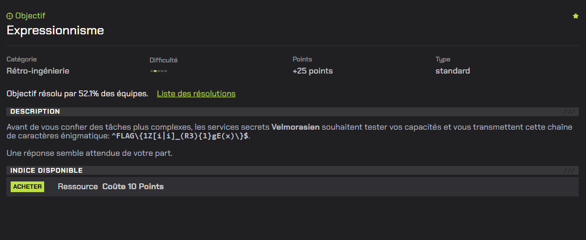
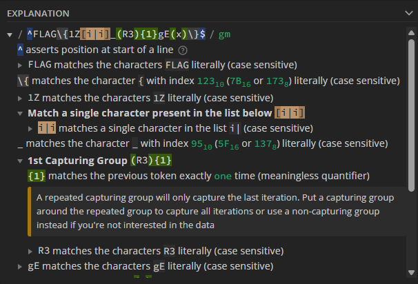
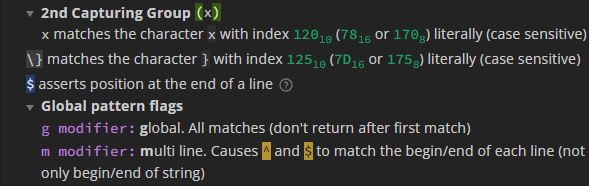
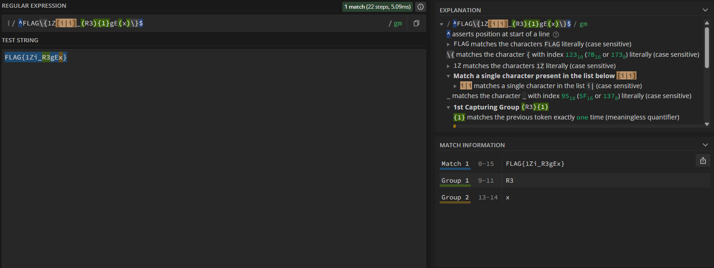

# Le repaire - Partie 1



# Writeup

Le challenge fournit la chaîne suivante :

```
^FLAG\{1Z[i|i]_(R3){1}gE(x)\}$
```

Il s’agit d’une expression régulière décrivant exactement le format du flag attendu.

L’objectif est donc de comprendre et reconstruire la chaîne qui correspond à cette regex.

Il est possible de décomposer cette expression avec des outils en ligne comme par exemple [reg101](https://regex101.com/).

Voici l'explication d'après l'outil :





Signification :

- `^` et `$` -> le flag doit correspondre à exactement toute la ligne (début et fin de ligne)
- `FLAG\{` -> le flag commence par `FLAG{`
- `1Z`-> caractères littéraux
- `[i|i]` -> un seul caractère parmi `i` ou `|`
- `_` -> underscore littéral
- `(R3){1}` -> correspond à `R3` "une fois"
- `gE` -> caractères littéraux
- `(x)` -> caractère x 
- `\}` -> fin du flag avec `}`

En reconstruisant la chaîne caractère par caractère et en testant si le regex match on trouve le flag : 



```
FLAG{1Zi_R3gEx}
```