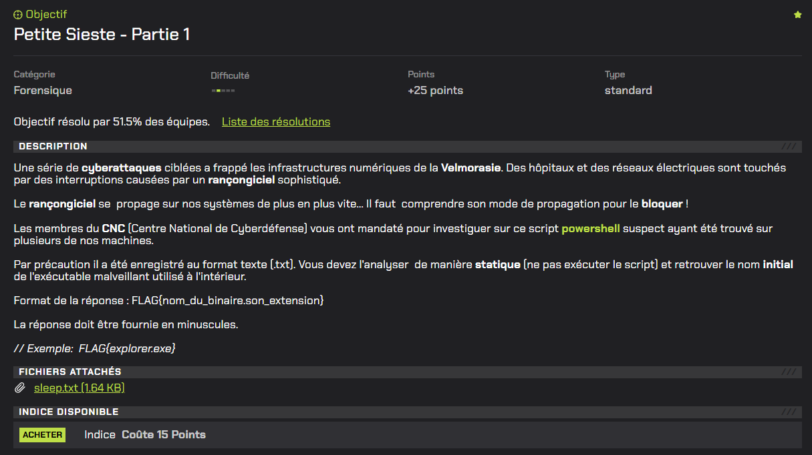
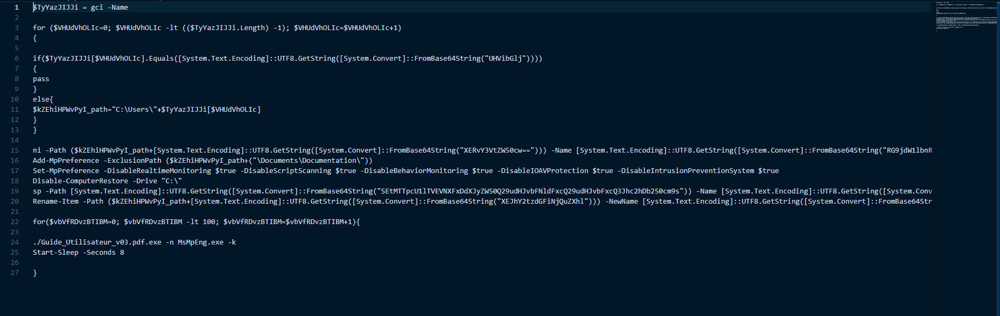
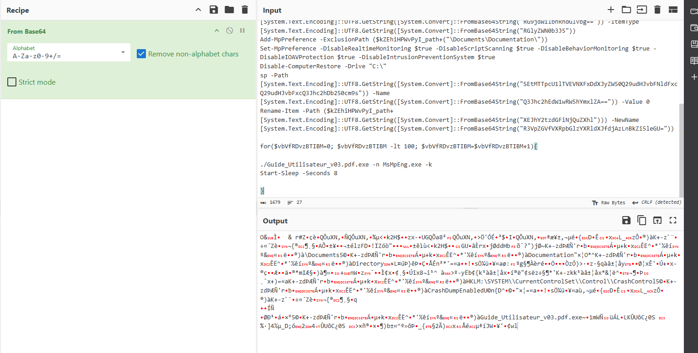

# Petite Sieste - Partie 1

# Writeup

Le fichier fourni est un script PowerShell enregistré au format texte (sleep.txt).

Voici un aperçu de celui-ci :

L’obfuscation repose principalement sur l’utilisation de chaînes encodées en Base64, décodées dynamiquement à l’aide des fonctions PowerShell `FromBase64String` et `GetString`.

Ces chaînes peuvent être décoder avec [Cyberchef](https://gchq.github.io/CyberChef/) :

