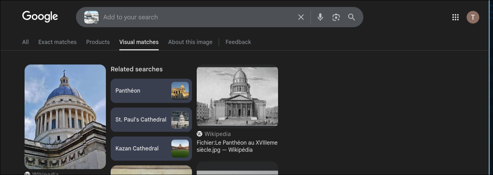

# Le repaire - Partie 1


# Writeup

Dans ce challenge, nous avons la représentation 3D de la vue depuis le repère des hackeurs, notre objectif est de retrouver le nom du monument sur la gauche de celle-ci.

Pour cela il suffit de prendre une capture uniquement du monument sur la gauche et de rechercher une correspondance visuelle sur Google Images.

Le monument qui correspond est le panthéon :



```
FLAG{pantheon}
```