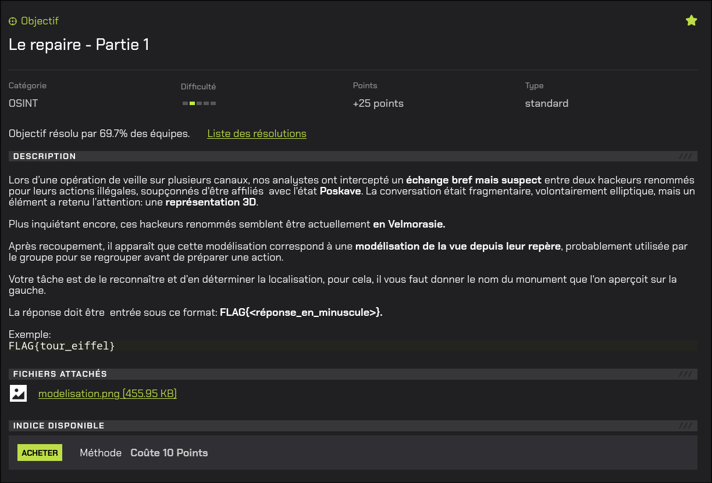
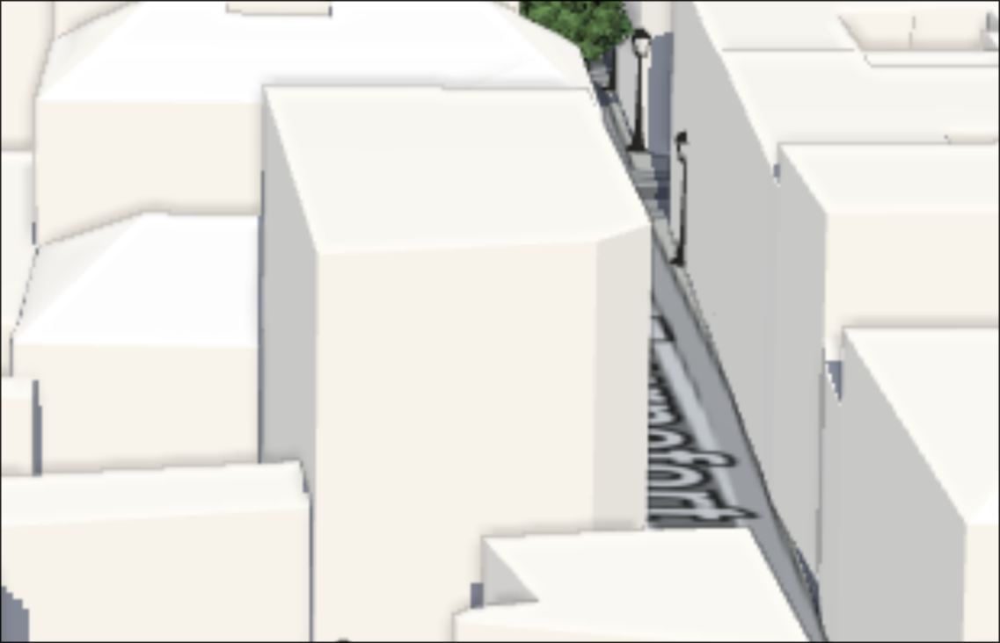
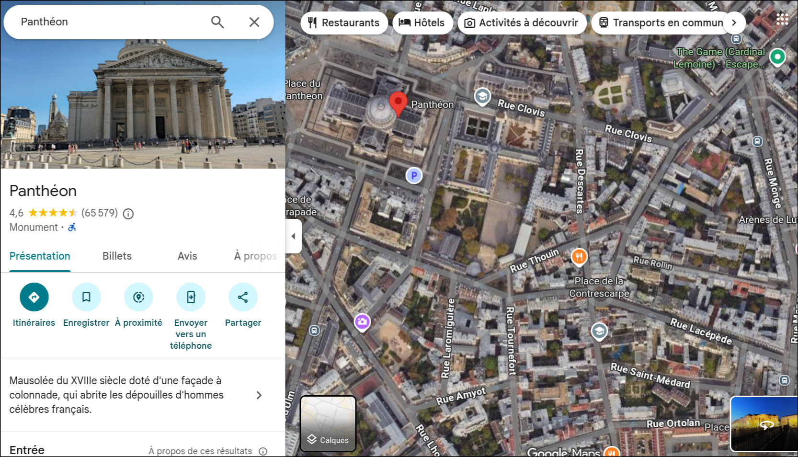

# Le repaire - Partie 1



# Writeup

Pour la suite du challenge, nous devons identifier la rue en bas à droite de cette représentation.

En zoomant sur celle-ci, nous pouvons déjà aperçevoir la fin du nom de la rue :



Le nom de la rue fini par ``fort``

En se basant sur la localisation, à l'aide de la vue satellite Google Maps on parvient à retrouver la rue :



```
FLAG{rue_tournefort}
```