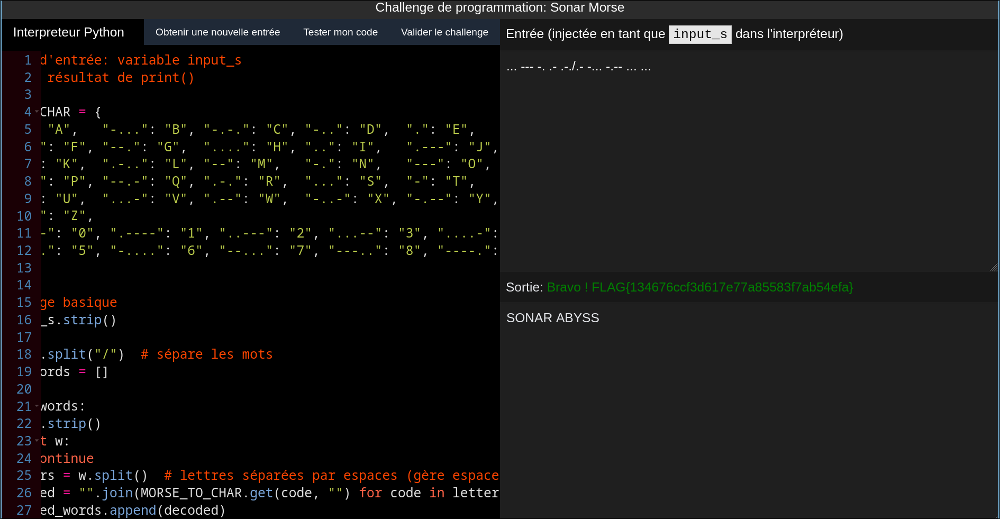

# Echo de L'Abîme - Décodager Sonar Morse

```
Des communications en Morse international entre les forces ennemies ont été captées par nos sonars. Chaque message est transmis sous la forme de points et de traits : Un espace sépare les lettres. Le symbole / sépare les mots. Votre objectif Traduire fidèlement ces signaux en texte clair MAJUSCULE pour révéler les ordres secrets de l’ennemi. Un mot mal traduit, et la flotte peut tomber dans une embuscade. Exemple: "... --- .../.--. --- .-. -" → "SOS PORT"
```

# Writeup

Dans ce challenge de programmation, on reçoit une chaîne en Morse international. 

Les lettres sont séparées par des espaces et les mots par `/`. Il faut décoder en texte clair en MAJUSCULE.

Voici le script qui permet de traduire chaque chaîne :

```py
# table morse -  caractère (morse international)
MORSE_TO_CHAR = {
    ".-": "A",   "-...": "B", "-.-.": "C", "-..": "D",  ".": "E",
    "..-.": "F", "--.": "G",  "....": "H", "..": "I",   ".---": "J",
    "-.-": "K",  ".-..": "L", "--": "M",   "-.": "N",   "---": "O",
    ".--.": "P", "--.-": "Q", ".-.": "R",  "...": "S",  "-": "T",
    "..-": "U",  "...-": "V", ".--": "W",  "-..-": "X", "-.--": "Y",
    "--..": "Z",
    "-----": "0", ".----": "1", "..---": "2", "...--": "3", "....-": "4",
    ".....": "5", "-....": "6", "--...": "7", "---..": "8", "----.": "9",
}

# enlève les espaces inutiles au début/fin
s = input_s.strip()

# sépare les mots (le / est le séparateur de mots)
words = s.split("/")

decoded_words = []
for w in words:
    w = w.strip()
    if not w:
        continue

    # sépare les lettres d’un mot (un ou plusieurs espaces)
    letters = w.split()

    # convertit chaque code morse en lettre, puis recompose le mot
    decoded = "".join(MORSE_TO_CHAR.get(code, "") for code in letters)
    decoded_words.append(decoded)

# recompose la phrase avec des espaces entre les mots
print(" ".join(decoded_words))
```

Nous pouvons valider le challenge avec celui-ci :



On recupère le flag :

```
FLAG{134676ccf3d617e77a85583f7ab54efa}
```