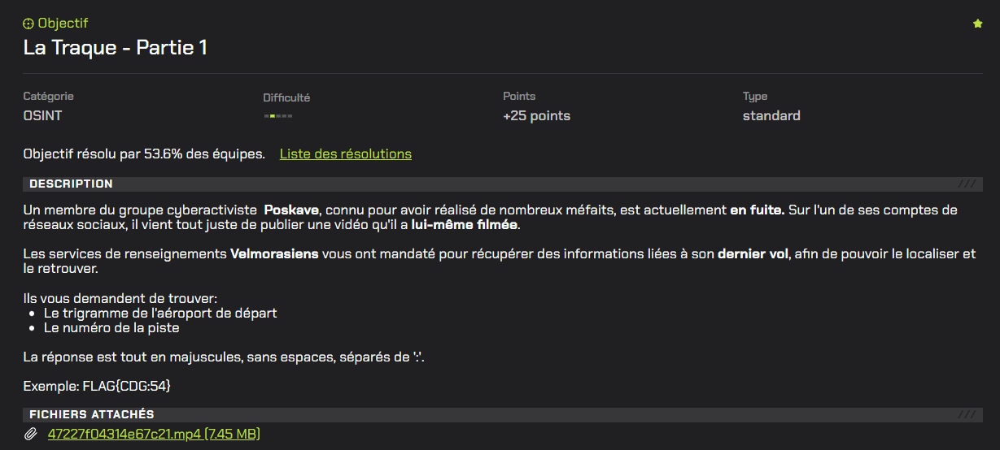
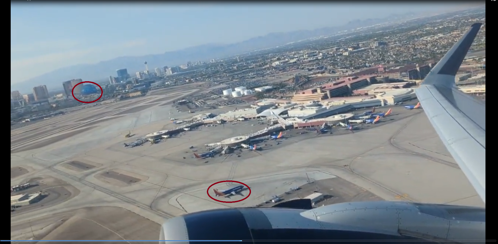
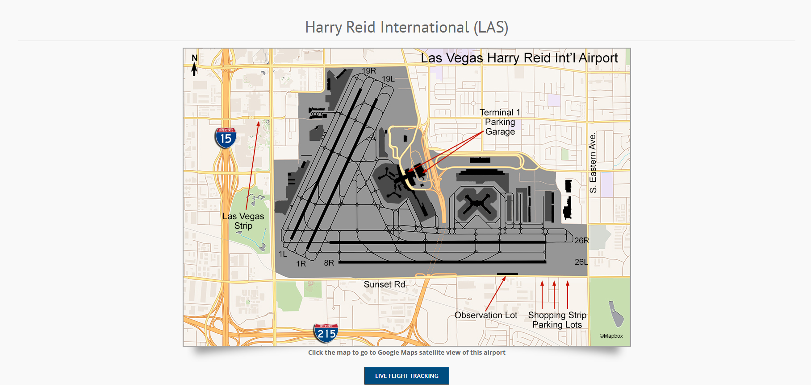
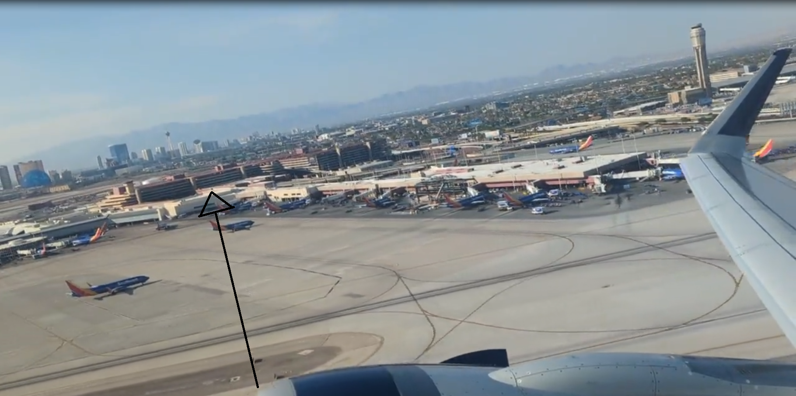

# La Traque - Partie 1



# Writeup

Dans ce challenge nous avons à disposition la vidéo d'un qui décolle.

Le premier objectif est de trouver le trigramme de l'aéroport de départ.

Pour ce faire, il faut analyser la ville au moment du décollage de l’avion : 



Les élements marquants sont la couleur des avions mais surtout une sphère très connu dans le fond de l'image.

La `Sphere at The Venetian Resort`, une salle de concerts à `Las Vegas` aux États-Unis.

Nous avons trouvé le premier élement, le trigramme de l'aéroport de Las Vegas est `LAS`.

Ensuite pour avoir le numéro de la piste d'où décolle l'avion il nous faut le plan des pistes de cet aéroport disponible sur [flightaviationmedia](https://flightlineaviationmedia.com/planespotting/airports/las-vegas/) :



D'après la proximité avec les bâtiments dans la vidéo : 



Nous pouvons conclure que la piste sur laquelle se trouve l'avion est la `26R` :

```
FLAG{LAS:26R}
```

