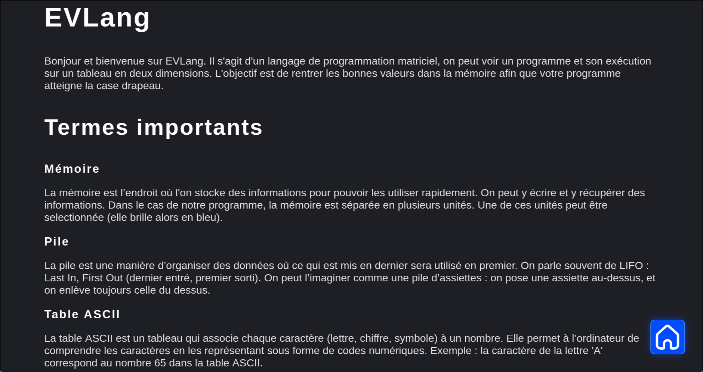
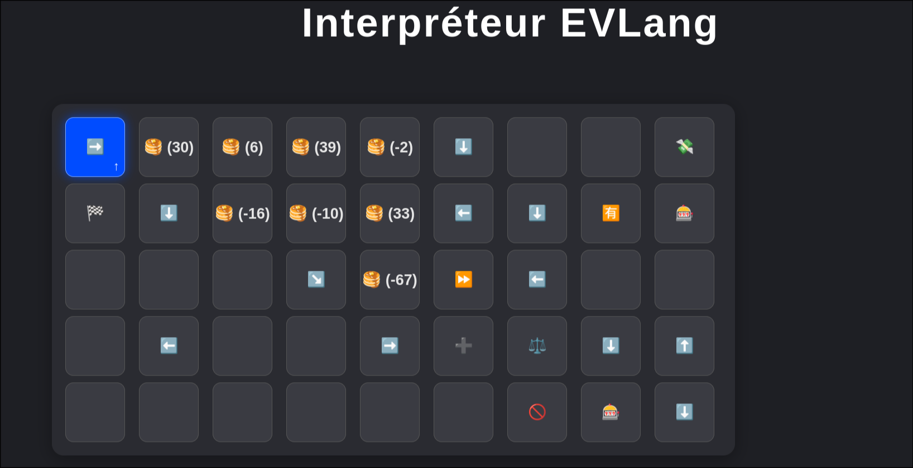
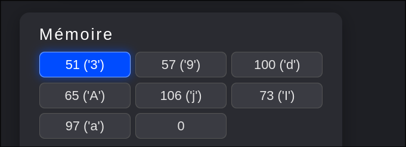
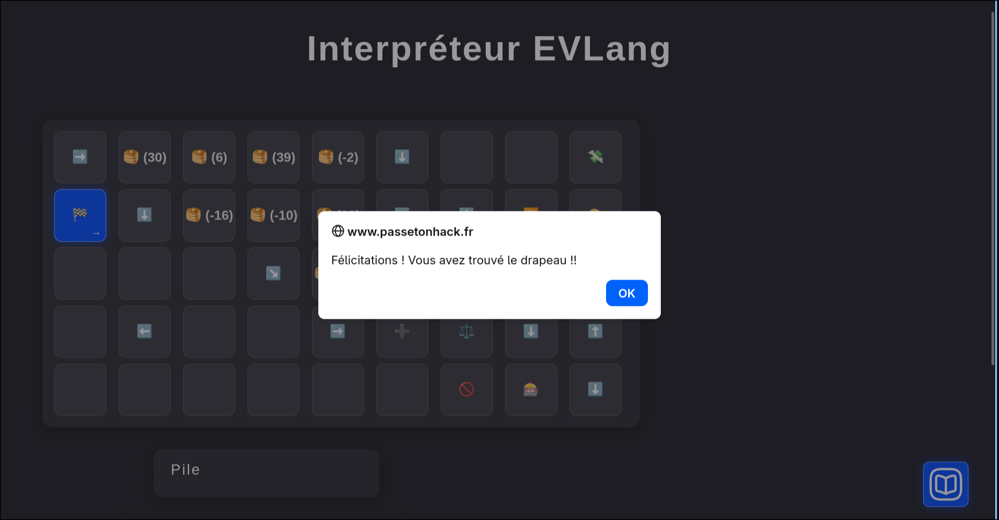

# EVLang

# Writeup



La documentation explique `qu’EVLang` est un langage basé sur une grille `2D` où un curseur exécute les cases, et que pour réussir il faut charger un texte en mémoire (converti en ASCII) afin d’influencer l’exécution jusqu’au drapeau.

lle précise aussi que la pile fonctionne en LIFO, et que l’interface permet d’analyser le programme facilement grâce au mode `pas à pas` (avec `wrap-around` sur les bords - si le curseur sort de la grille il réapparaît de l'autre côté).

D’après la doc les instructions qui nous intéressent ici sont :

```
- 💸: Cette instruction va retirer la valeur du dessus de la pile. Cela va réduire la taille de la pile.

- 🈶 : Cette instruction récupère la valeur pointée en mémoire (qui est donc indiquée en bleu) et va la pousser au dessus de la pile. Cela ne la retire pas de la mémoire.

- ⏩ : Cette instruction change la valeur pointée en mémoire pour la valeur d'après.

- ➕ : Cette instruction prend les deux dernières valeurs de la pile (et les retire de cette dernière) pour les additionner. Le résultat est poussé au dessus de la pile. 

- ⚖️ : Cette instruction prend les deux dernières valeurs de la pile (et les retire de cette dernière) pour les comparer. Le résultat est poussé au dessus de la pile, si les valeurs sont égales, le résultat sera donc 0.

- 🎰 : Cette instruction utilise la dernière valeur de la pile pour influer sur l'exécution du programme. Si cette valeur est 0 ou si la pile est vide, alors le curseur va à droite. Sinon il ira à gauche.


Le duo ⚖️ + 🎰 est le “if/else” : on fabrique un 0 quand la condition est vraieS et 🎰 choisit un chemin.
```

Voici la grille de l'interpréteur :



Le début du programme empile plusieurs constantes :

`30, 6, 39, -2`

Puis plus loin dans la grille :

`-16, -10, 33`

Donc au total on a 7 constantes sur la pile.

On repère dans la grille une séquence répétable :

```
🈶 (lit mémoire -> pile)

🥞(-67)

➕ (addition)

⚖️ (compare)

🎰 (branche)

si mauvais -> 🚫

si bon -> on continue et la boucle recommence avec le caractère mémoire suivant
```

Ce pattern correspond exactement à ce qui est décrit dans la doc :

```
🈶 amène un ASCII dans la pile 

➕ calcule une somme 

⚖️ donne 0 si égalité 

🎰 choisit la branche “bonne” si 0 
```
## Algorithme

Le programme applique la même suite d’instructions pour chaque caractère du mot de passe.

Les étapes suivantes correspondent  à une itération de la boucle de vérification, c’est-à-dire la validation d’un caractère de l’input.

Pour la suite de ce résumé, on note :

```
x = valeur ASCII du caractère actuellement sélectionné en mémoire (lu grâce à 🈶)

K = constante attendue (prise depuis la pile)

la grille pousse aussi -67
```

### Étapes d’une itération de la boucle de vérification

- Étape 1 - Lecture du caractère courant (🈶) :

Le programme récupère le caractère actuellement sélectionné dans l’input utilisateur, le convertit en valeur ASCII et la pousse sur la pile.

- Étape 2 - Application du décalage `-67` (🥞(-67) puis ➕) :

Le programme pousse `-67` puis additionne ce qui calcule :

```
x - 67
```
- Étape 3 - Comparaison avec la constante attendue (⚖️)

Le résultat `x - 67` est comparé à une constante `K`.

Si les valeurs sont égales ⚖️ renvoie `0`.

- Étape 4 - Branchement conditionnel (🎰):

🎰 utilise le résultat de ⚖️ :

```
si 0 -> branche droite (continuer)

sinon -> branche gauche (échec 🚫)
```

### Condition de validation d’un caractère

Après ces étapes on obtient l’expression suivante :

```
le programme calcule x - 67

puis compare ce résultat avec une constante K
```

Pour que la comparaison réussisse (et que ⚖️ renvoie `0`) il faut donc que :

```
x - 67 = K
```

Ce qui revient à :

```
x = K + 67
```

Autrement dit, chaque caractère du mot de passe doit avoir un code ASCII égal à la constante attendue "plus `67`".

### Ordre des constantes

D'après la documentation :
 
```
La pile est une manière d’organiser des données où ce qui est mis en dernier sera utilisé en premier. On parle souvent de LIFO.
```

Or au début du programme, plusieurs constantes sont empilées :

```
30, 6, 39, -2, 33, -10, -16
```

Comme la pile fonctionne en `LIFO` (Last In First Out), ces valeurs sont utilisées dans l’ordre inverse :

```
-16, -10, 33, -2, 39, 6, 30
```

> Si on execute pas à pas le le programme on retrouve bien les constantes dans cet ordre

Le programme va donc vérifier notre input caractère par caractère selon cet ordre.


### Calcul du mot de passe :

On applique la formule :

```
x = K + 67 autrement dit ASCII(caractère) = K + 67 
```

On obtient alors :

```
-16 + 67 = 51 -> '3'

-10 + 67 = 57 -> '9'

33 + 67 = 100 -> 'd'

-2 + 67 = 65 -> 'A'

39 + 67 = 106 -> 'j'

6 + 67 = 73 -> 'I'

30 + 67 = 97 -> 'a'
```

Le mot de passe attendu est donc :

```
39dAjIa
```

Nous pouvons vérifier cela en le chargeant sur la pile et en éxécutant le programme :





On tombe bien sur la case drapeau et nous pouvons valider le challenge avec le flag :

```
FLAG{39dAjIa}
```


