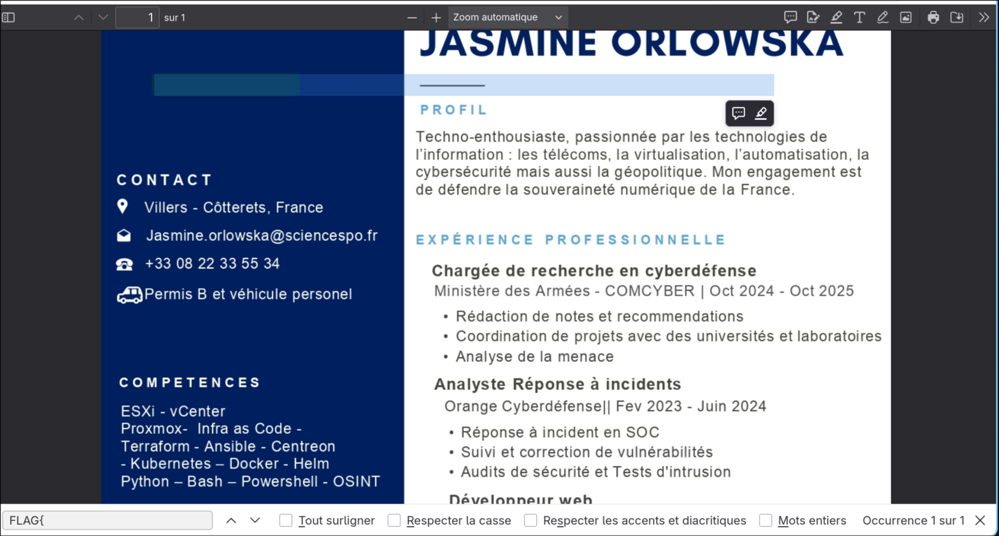

# La recrue


# Writeup

- Dans un premier temps, nous pouvons ouvrir le pdf pour voir si quelque chose d'intéressant est affiché.

- A première vu, rien, or nous savons que le format du flag est : ```FLAG{...}```

En cherchant avec la fonctionnalité Control Find (Crtl+F), nous parvenons à retrouver le flag caché :



```
FLAG{Y0u_C4n'T_SEe_M3}
```