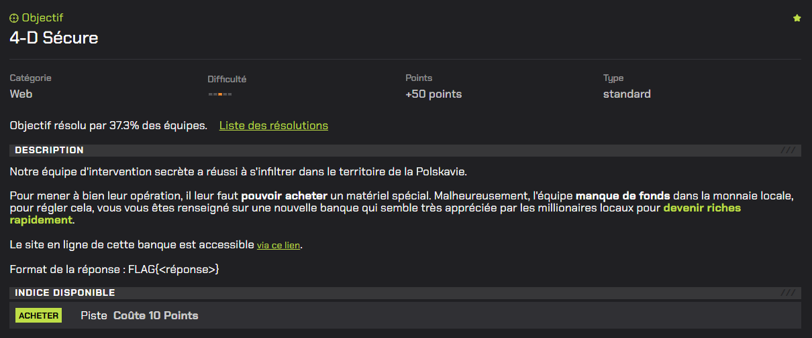
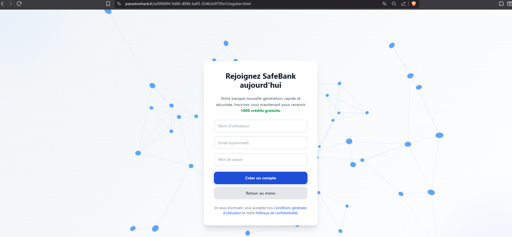
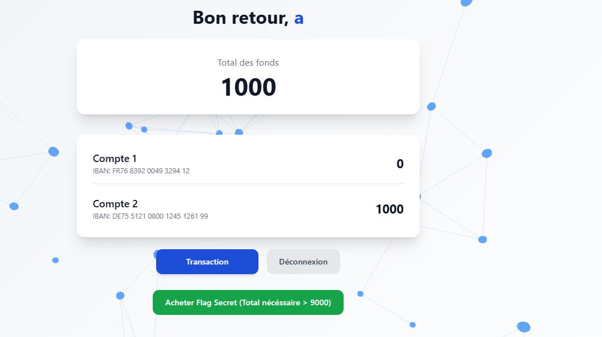
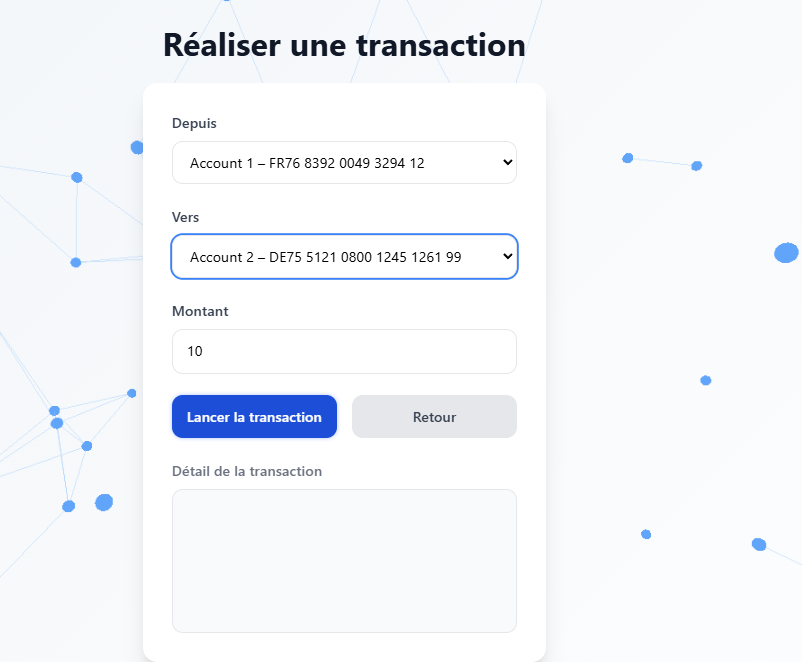
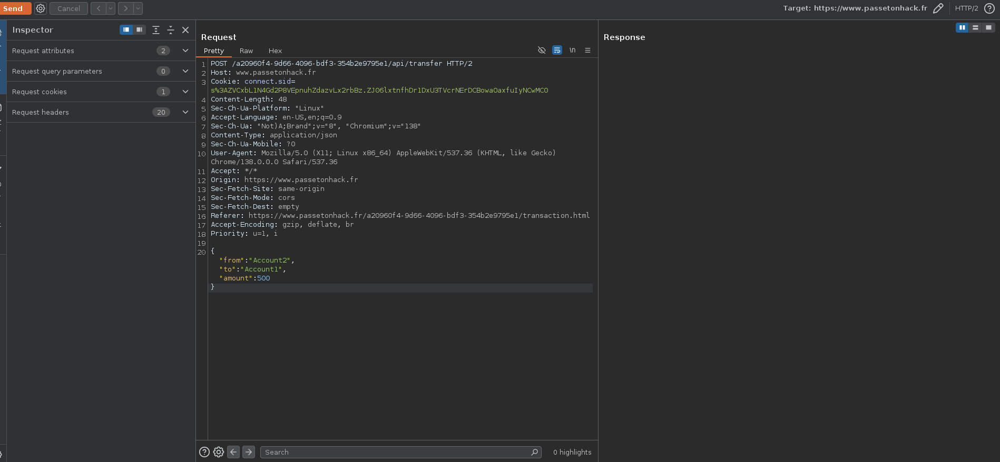

# 4-D Sécure



# Writeup

Dans ce challenge, nous avons accès au site de la banque sur lequel nous pouvons nous register :



Une fois register, une nouvelle page apparaît sur laquelle est indiquée le total des fonds: `1000` , qui correspondent aux crédits fournis à la création d'un compte.



La page la plus intéressante est la page de transaction :



Sur la page de transaction, il est possible d’effectuer un transfert de fonds entre deux comptes en renseignant :

- le compte source,

- le compte destination,

- le montant à transférer.

En observant les requêtes réseau via l’outil Burp Suite, on constate que cette action déclenche une requête HTTP POST vers un endpoint de type API :



Cette requête est authentifiée uniquement via les cookies de session et ne contient aucun mécanisme supplémentaire de protection tel qu’un identifiant de transaction ou  un token à usage unique

Cela signifie que la même requête peut être rejouée plusieurs fois sans être distinguée par le serveur.

En observant les logs de l’application lors d’un transfert unique, on constate la séquence suivante :

```
Démarrage de la transaction
Vérification des fonds
Décision
Fin de la transaction
```

Donc en envoyant plusieurs requêtes de transfert simultanément, plusieurs transactions passent la vérification avant que le solde ne soit mis à jour.