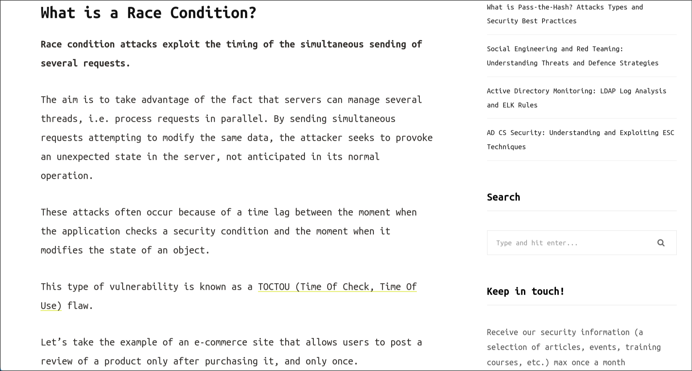
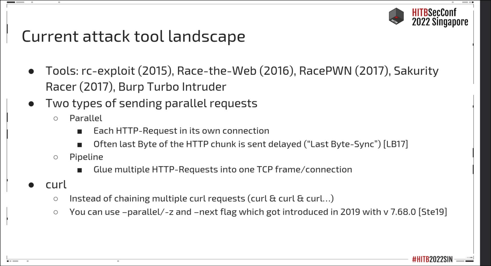
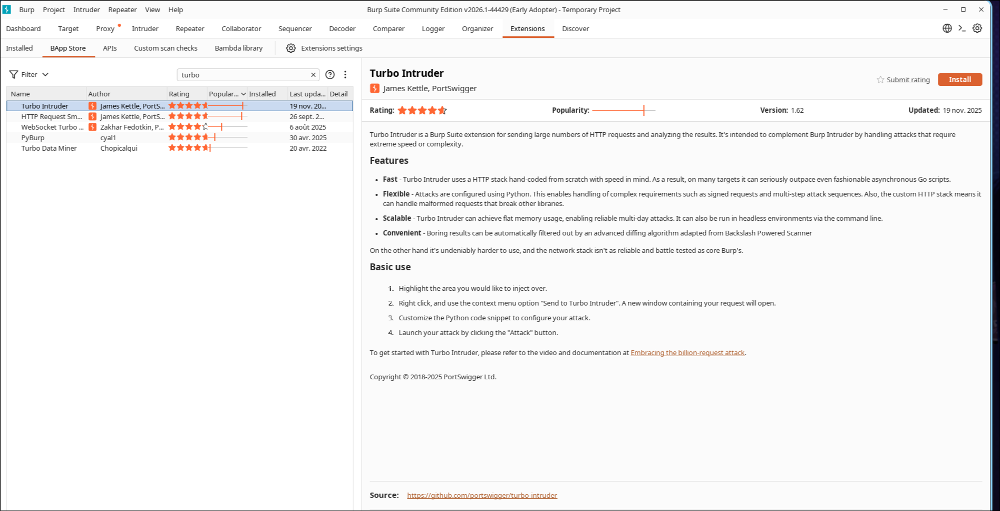
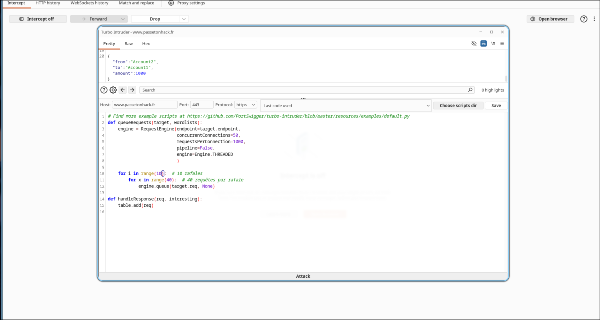
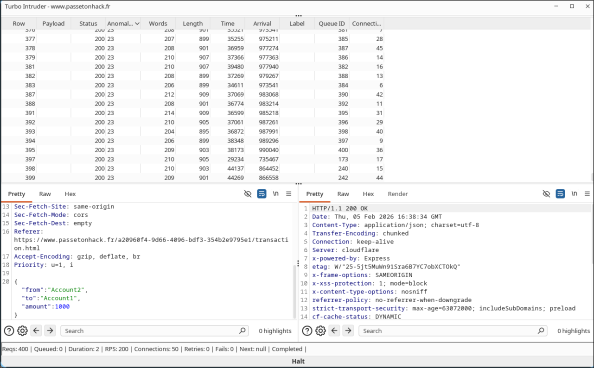
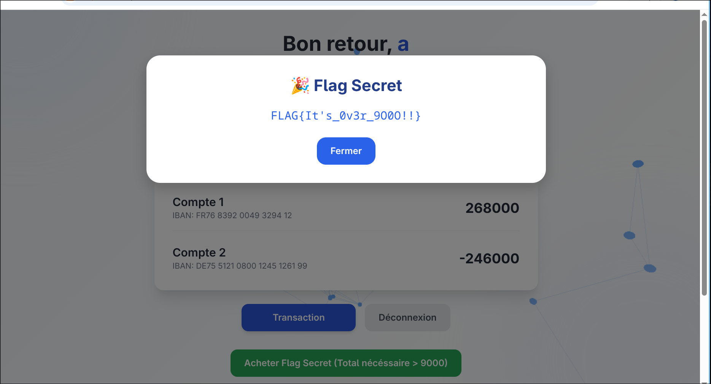

# 4-D Sécure


# Writeup

Dans ce challenge, nous avons accès au site de la banque sur lequel nous pouvons nous register :


Une fois register, une nouvelle page apparaît sur laquelle est indiquée le total des fonds: `1000` , qui correspondent aux crédits fournis à la création d'un compte.


La page la plus intéressante est la page de transaction :


Sur la page de transaction, il est possible d’effectuer un transfert de fonds entre deux comptes en renseignant :

- le compte source,

- le compte destination,

- le montant à transférer.

En observant les requêtes réseau via l’outil Burp Suite, on constate que cette action déclenche une requête HTTP POST vers un endpoint de type API :


Cette requête ne contient aucun identifiant unique de transaction (pas de token spécial), ce qui signifie qu’elle peut être rejouée plusieurs fois.

En observant les logs de l’application lors d’un transfert, on constate que celui-ci s'effectue en plusieurs étapes :

```
Démarrage de la transaction
Vérification des fonds
Décision (Fond suffisants/insuffisants)
Fin de la transaction
```

Quand on fait une seule requête, le serveur refuse correctement si le compte n’a pas assez d’argent.

Mais cette vérification prend un peu de temps.

Donc pendant ce délai, si plusieurs requêtes arrivent en même temps, elles peuvent toutes vérifier le solde avant qu’il ne soit mis à jour.

Celà signifie que si nous envoyons plusieurs requêtes identiques simultanément (rafale), plusieurs transferts sont validés alors qu’un seul devrait passer.

On appelle ce type de type de vulnérabilité une "race condition" [(blog)](https://www.vaadata.com/blog/what-is-a-race-condition-exploitations-and-security-best-practices/) :




Maintenant, en pratique, comment exploiter cette vulnérabilité ?


Il existe plusieurs possibilités :



Burp Turbo Intruder est l'extension qui parraît être une solution raisonnable :



Après l'avoir installé, nous pouvons adapter le script python qui permet de réaliser l'attaque :



La race condition dépend du timing. Envoyer 10 rafales de 40 requêtes augmente les chances que plusieurs transactions passent simultanément la vérification du solde [(TOCTOU)](https://en.wikipedia.org/wiki/Time-of-check_to_time-of-use).



Ensuite on retourne sur le dashboard pour voir si l'exploit a fonctionné et si nous avons les fonds nécessaires pour acheter le flag (9000).

Effectivement c'est le cas : 



```
FLAG{It's_0v3r_9O0O!!}
```