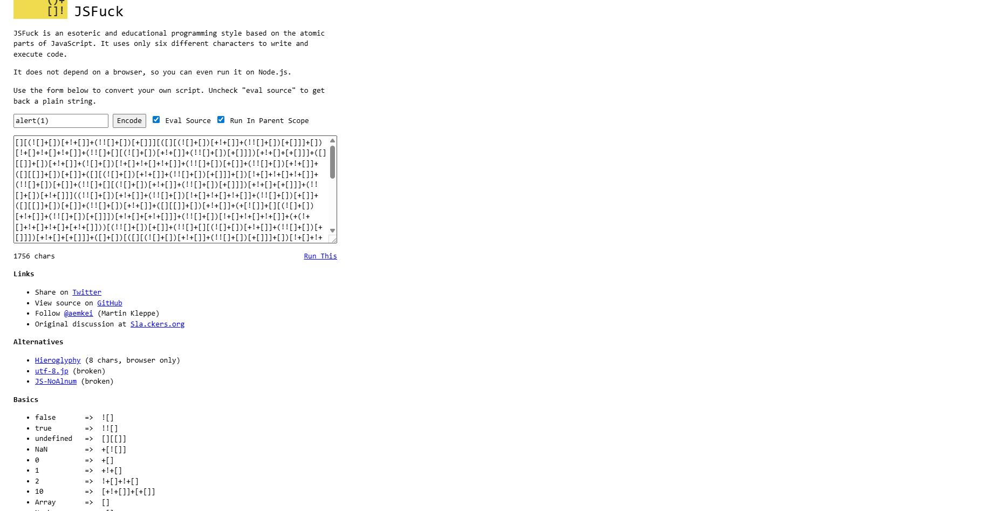
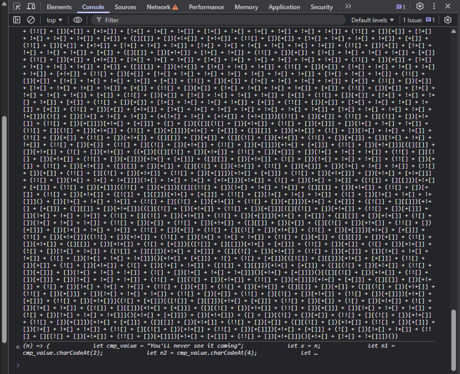
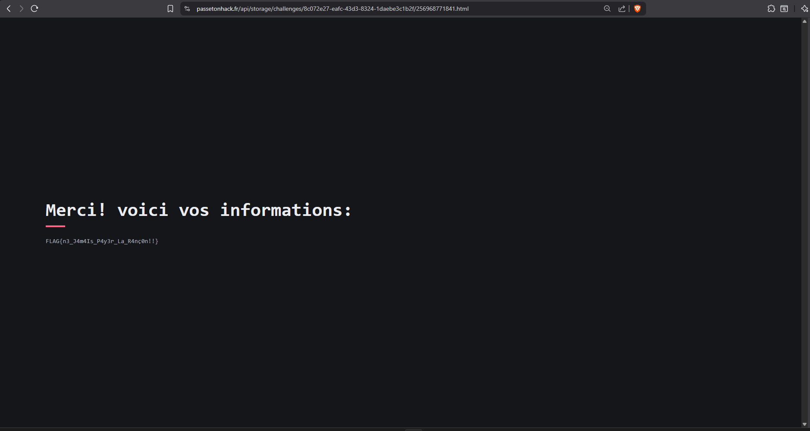

# Connecte4

```
Une série de cyberattaques ciblées a frappé les infrastructures numériques de la Velmorasie. Des hôpitaux et des réseaux électriques sont touchés par des interruptions causées par un rançongiciel sophistiqué. Ce rançongiciel se propage sur de nombreux systèmes d'information stratégiques fournissant des services critiques. Vous avez été mandaté par le Centre National de la Cyberdéfense pour analyser la nature du blocage, dans le but de récupérer les codes nécessaires à la récupération des données, sans payer ! L'un des sites compromis est accessible via cette URL, nous comptons sur vous... Format de la réponse : FLAG{<réponse>}
```

# Writeup

Dans ce challenge nous avons accès à un site web “compromis” qui simule un portail de rançongiciel : il demande 4 codes successifs.

Après inspection du code source, toute la logique de vérification est réalisée côté client dans un script chargé en module ES6.

La page importe directement `num1`, `num2` et `num4` depuis `./release.js` :

```js
import { num1, num2, num4 } from "./release.js";
```

Voici le script `release.js` :

```js
async function instantiate(module, imports = {}) {
  const adaptedImports = {
    env: Object.setPrototypeOf({
      "Date.now"() {
        // ~lib/bindings/dom/Date.now() => f64
        return Date.now();
      },
      abort(message, fileName, lineNumber, columnNumber) {
        // ~lib/builtins/abort(~lib/string/String | null?, ~lib/string/String | null?, u32?, u32?) => void
        message = __liftString(message >>> 0);
        fileName = __liftString(fileName >>> 0);
        lineNumber = lineNumber >>> 0;
        columnNumber = columnNumber >>> 0;
        (() => {
          // @external.js
          throw Error(`${message} in ${fileName}:${lineNumber}:${columnNumber}`);
        })();
      },
    }, Object.assign(Object.create(globalThis), imports.env || {})),
  };
  const { exports } = await WebAssembly.instantiate(module, adaptedImports);
  const memory = exports.memory || imports.env.memory;
  function __liftString(pointer) {
    if (!pointer) return null;
    const
      end = pointer + new Uint32Array(memory.buffer)[pointer - 4 >>> 2] >>> 1,
      memoryU16 = new Uint16Array(memory.buffer);
    let
      start = pointer >>> 1,
      string = "";
    while (end - start > 1024) string += String.fromCharCode(...memoryU16.subarray(start, start += 1024));
    return string + String.fromCharCode(...memoryU16.subarray(start, end));
  }
  return exports;
}
export const {
  memory,
  num1,
  num2,
  num4,
} = await (async url => instantiate(
  await (async () => {
    const isNodeOrBun = typeof process != "undefined" && process.versions != null && (process.versions.node != null || process.versions.bun != null);
    if (isNodeOrBun) { return globalThis.WebAssembly.compile(await (await import("node:fs/promises")).readFile(url)); }
    else { return await globalThis.WebAssembly.compileStreaming(globalThis.fetch(url)); }
  })(), {
  }
))(new URL("release.wasm", import.meta.url));
```

Ce fichier n'implémente pas réellement les fonctions, il sert d'interface entre `JavaScript` et `WebAssembly`.

Il charge le fichier `release.wasm`, le compile et l'instancie puis récupère les fonctions exportées par `release.wasm` et les rend "utilisables" en JavaScript (num1, num2, num4).

Ensuite, la page définit un tableau de fonctions de validation, utilisé dans l’ordre à chaque soumission :

```js
let validation_functions = [
  (inp) => 466 === num1(inp, 42),
  (inp) => 28318006 === num2(inp),
  (inp) => 31290 === num3(inp),
  (inp) => inp === num4(29),
];
```

Concrètement, l'utilisateur doit entrer 4 nombres, à chaque fois qu'il saisit un nombre, le script récupère le chiffre saisi, les concatènes en un entier :

```js
const get_raw_input = () => {
    let res = "";

    inputs.forEach(elt => {
        if (elt.value.length !== 1 || isNaN(elt.value))
            return;
        res = res.concat("", elt.value);
});

            return res;
        }
```

Puis applique la fonction de validation correspondant au rang (1ère saisie -> num1, 2ème -> num2, etc.). 
Si le test échoue, l’entrée est rejetée ; s’il réussit, le code est conservé dans `raw_inputs`.

Une fois les 4 validations réussies (`valid_count >= 4`), la page redirige vers une URL construite par concaténation de ces quatre valeurs :

```js
window.location = `${raw_inputs[0]}${raw_inputs[1]}${raw_inputs[2]}${raw_inputs[3]}.html`;
```

Pour retrouver `num1`, `num2` et `num4`, il nous faut donc étudier et récupèrer les fonctions dans `release.wasm`.

WebAssembly possède un format texte(`.wat`) et un format binaire(`.wasm`).

Le format texte est disponible dans -> DevTools -> Sources.

Voici la fonction `$num1` :

```wat
(func $num1 (;2;) (export "num1") (param $var0 i32) (param $var1 i32) (result i32)
    local.get $var0
    local.get $var1
    i32.const 5
    i32.mul
    i32.add
  )
```

```
Entrées : (param $var0 i32) (param $var1 i32)

Sortie : (result i32)
```

`local.get $var0` -> met `var0` sur la pile

`local.get $var1` -> met `var1` sur la pile (au-dessus)

`i32.const 5` -> met la constante `5` sur la pile

`i32.mul` -> dépile les deux derniers (ici `var1` et `5`) et pousse `var1 * 5`

`i32.add` -> dépile les deux derniers (ici `var0` et `var1*5`) et pousse `var0 + (var1*5)`

En pseudo-code C :

```c
int32_t num1(int32_t var0, int32_t var1) {
  return var0 + (var1 * 5);
}
```

Cela signifie que :

```
num1(a,b) = a + 5b
```

Or d'après le tableau de validation :

```js
(inp) => 466 === num1(inp, 42),
```

Donc, si on admet b = 42 et a = inp : 

```js
num1(inp,42) = inp + 5 * 42 = inp + 210
```

Et : 

```js
466 === num1(inp, 42)
```
Cela donne :

```js
466 = inp + 210
```

On résout l'équation pour retrouver inp :

```js
inp = 466 - 210 = 256
```

Nous avons donc `num1 = 256`

Ensuite la fonction `$num2` : 

```wat
(func $num2 (;4;) (export "num2") (param $var0 i32) (result i32)
    (local $var1 i64)
    call $env.Date.now
    i64.trunc_sat_f64_s
    i64.const 1500
    i64.add
    local.set $var1
    loop $label0
      local.get $var1
      call $env.Date.now
      i64.trunc_sat_f64_s
      i64.gt_s
      br_if $label0
    end $label0
    i32.const 999
    local.get $var0
    i32.sub
    call $func3
```

```
Entrées : (param $var0 i32)

Sortie : (result i32)

Locaux : (local $var1 i64)
```
`call $env.Date.now` -> appelle `Date.now() `(retourne un `f64` côté JS env)

`i64.trunc_sat_f64_s` -> convertit ce `f64` en `i64` 

`i64.const 1500` -> met la constante `1500` sur la pile

`i64.add` -> dépile les deux derniers et pousse `now_i64 + 1500`

`local.set $var1` -> stocke le résultat dans `var1`

-> `var1 = Date.now() + 1500`

`loop $label0` -> démarre une boucle

`local.get $var1` -> met `var1` sur la pile

`call $env.Date.now` -> remet `Date.now()` sur la pile

`i64.trunc_sat_f64_s` -> convertit `Date.now()` en `i64`

`i64.gt_s ->` compare signé : pousse `1 si var1 > now sinon 0`

`br_if $label0` -> si le résultat vaut `1`, on reboucle

-> donc on attend `1500 ms` environ jusqu’à ce que `Date.now()` rattrape `var1`

`i32.const 999` -> met la constante `999` sur la pile

`local.get $var0` -> met `var0` sur la pile (au-dessus)

`i32.sub` -> dépile les deux derniers et pousse `999 - var0`

`call $func3` -> appelle `func3(999 - var0)` et renvoie son résultat (`i32`)

En pseudo-code C :

```c
int32_t num2(int32_t var0) {
  int64_t var1 = (int64_t)Date_now_trunc() + 1500;
  while (var1 > (int64_t)Date_now_trunc()) {
    // attend 1500 ms
  }
  return func3(999 - var0);
}
```
Cela signifie que :

```js
num2(a) = func3(999 - a)
```

Or d'après le tableau de validation :

```js
(inp) => 28318006 === num2(inp)
```

Donc si on admet `a = inp` :

```js
num2(inp) = func3(999 - inp)
```

Et :

```js
28318006 === num2(inp)
```

Cela donne :

```js
28318006 = func3(999 - inp)
```

On pose :

```js
x = 999 - inp
```
Donc :

```js
28318006 = func3(x)
```

Et :

```js
inp = 999 - x
```

Pour retrouver inp, il faut trouver x tel que :

```
func3(x) = 28318006
```

Puis calculer :

```js
inp = 999 - x
```

Pseudo-C de `func3` :

```c
int32_t func3(int32_t n) {
  // base case
  if (n <= 1 || n > 40) { 
    return 2;
  }

  // récursion type Fibonacci + 11
  return func3(n - 1) + func3(n - 2) + 11;
}

```

On remarque que si x `<= 1` ou `x > 40`, alors `func3(x) = 2`, donc impossible d’obtenir `28318006`.

Donc forcément :

```js
2 <= x <= 40
```

On calcule alors la suite donnée par :

```js
func3(0)=2
func3(1)=2
func3(n)=func3(n-1)+func3(n-2)+11
```

Ce qui donne :

```js
func3(31) = 28318006
```

Donc `x = 31`

Et comme :

`x = 999 - inp`

On résout l'équation pour retrouver inp :

```js
inp = 999 - 31 = 968
```

Nous avons donc `num2 = 968`

Ensuite pour `func $num4`, celle-ci étant très longue de part un arbre de conditions, voici une version en Pseudo-C raccourci :

```c
int num4(int a) {
  int v1 = 0;   // local $var1
  int v2 = 0;   // local $var2

  // (prologue "stack") : si stack trop basse -> abort
  global0 -= 4;
  if (global0 < 1068) abort();

  // équivalent de: i32.store (global0, 0)
  *(int*)(memory + global0) = 0;

  while (a > 0) {

    if (a % 11 == 0) {
      v1 = 4242;
      a  = a / 11;
    }

    else if (a % 9 == 0) {
      v1 = v1 & (-1431655766);
      a  = a - 3;
    }

    else if ( (a & 7) == 0 ) {
      v1 = v1 / 2;
      a  = a - 8;
    }

    else if (a % 7 == 0) {
      a = (a / 7) << 1;
    }

    else if (a % 6 == 0) {
      v1 = v1 | 47;
      a  = (a / 2) - 1;
    }

    else if (a % 5 == 0) {

      if ( (a & 3) == 0 ) {
        v1 = v1 + 1;
        a  = (a & 43690) - 1;
      }

      else if (a % 3 == 0) {

        // cas "break": (a & 1) != 0
        if (a & 1) {
          break;
        } else {
          v1 = v1 / 3;
          a  = (a / 3) - 1;
        }

      } else {
        v1 = v1 + 2;
        a  = a - 1;
      }
    }

    else {
      // bloc "mémoire" du WASM
      *(int*)(memory + global0) = 1056;
      global0 -= 4;
      if (global0 < 1068) abort();
      *(int*)(memory + global0) = 0;
      *(int*)(memory + global0) = 1056;

      // calcule v2 selon memory[1052] et memory[1056]
      if ( ((*(int*)(memory + 1052) >> 1) == 0) ) {
        global0 += 4;
        v2 = -1;
      } else {
        v2 = *(uint16_t*)(memory + 1056); // load16_u
        global0 += 4;
      }

      v1 = v1 + v2;
      a  = a - 6;
    }
  }

  // épilogue stack
  global0 += 4;

  // return v1 + a*a
  return v1 + a*a;
}
```

Cela donne :

```js
num4(inp) = (v1 accumulé pendant la boucle) + (inp_final * inp_final)
```

`inp_final` = la valeur de `var0` au moment où la boucle s’arrête (soit `var0 <= 0`, soit le “break” via (`var0 & 1)` dans la branche `(%5 puis %3)`).

`v1` dépend du chemin pris dans l’arbre de conditions

La condition fixé dans le tableau de validations :

```js
(inp) => inp === num4(29)
```

Veut dire que `inp = num4(29)`

Calcul de `num4(29)` :

Sur la branche tout au fond, on arrive à :

```js
29 % 11 != 0 ✅

29 % 9 != 0 ✅

(29 & 7) != 0 ✅

29 % 7 != 0 ✅

29 % 6 != 0 ✅

29 % 5 != 0 ✅

(29 & 3) != 0 ✅

29 % 3 != 0 ✅

(29 & 1) != 0 ✅ -> `br_if $label1` déclenche une sortie (ça casse la boucle)
```

Du coup, la boucle s’arrête immédiatement, avec :

```js
var1 = 0

var0 = 29
```

Et la fin de `num4` fait :

```js
return var1 + var0*var0
```
Donc :

```js
num4(29) = 0 + 29*29 = 841
```

Conclusion :

```js
inp = num4(29) = 841 --> inp = 841
```

Nous avons donc `num4 = 841`

Il ne nous manque plus que `num3`.

Dans la page on remarque qu'une constante `num3` est déjà défini mais dans un format bizarre :

```js
const num3 = [][(![] + [])[+!+[]] + (!![] + [])[+[]]][([][(![] + [])[+!+[]] + (!![] + [])[+[]]] + [])[!+[] + [...]
```

En effectuant quelques recherches on trouve de quoi il s'agit :



C'est du JSFuck :

JSFuck est un style de programmation ésotérique et éducatif basé sur les parties atomiques de JavaScript. Il utilise seulement six caractères différents pour écrire et exécuter du code.

>[!NOTE] 
> Ayant effectué le module `Javascript Obfuscation` de `HackTheBox` je sais que l'on peut exécuter ce code par à l'aide de la console du navigateur et celui-ci est éxécuté normalement comme du `Javascript`.

On éxécute donc la constante et on récupère un script :



```js
 (n) => {
    let cmp_value = "You'll never see it coming";
    let x = n;
    let n1 = cmp_value.charCodeAt(2);
    let n2 = cmp_value.charCodeAt(4);
    let n3 = cmp_value.charCodeAt(9);
    for (let i = 0; i < cmp_value.length; i++) {
        x += cmp_value.charCodeAt(i) * (i % 2 === 0 ? 1 : -1);
    }
    return 42 * (x ^ n1 ^ n2 ^ n3);
}
```
On part d'une phrase fixe : `"You'll never see it coming"`

Et de `let x = n;`

On prend 3 codes de caractères dans la chaîne :

```
index 2 = 'u' → 117

index 4 = 'l' → 108

index 9 = 'v' → 118
```

Donc `n1 = 117` , `n2 = 108` et `n3 = 118`

Ensuite on ajoute/soustrait alternativement les charCodes à x :

- si i est pair → on ajoute le code du caractère

- si i est impair → on soustrait le code du caractère

Comme la chaîne est fixe, cette boucle ajoute toujours la même constante à x.

Pour cette phrase, la somme alternée vaut `-125`.

Donc après la boucle :

```js
return 42 * (x ^ n1 ^ n2 ^ n3);
```

On mélange avec XOR puis on multiplie par 42.

Le XOR (^) en JS est un XOR bit-à-bit sur des entiers 32-bit.

Comme n1, n2, n3 sont constants, on peut les regrouper :

```
n1 ^ n2 ^ n3 = 117 ^ 108 ^ 118
```

Donc la fonction entière se simplifie en :

```js
return 42 * ((n - 125) ^ 111);
```

Le test de validant étant :

```js
(inp) => inp === num4(29),
```

Donc : 

```js
31290 = 42 * ((inp - 125) ^ 111)
```

On divise par 42 :

```
31290 / 42 = 745
```
Donc :

```js
745 = (inp - 125) ^ 111
```

On “dé-xor” (XOR est son propre inverse) :

```js
inp - 125 = 745 ^ 111
```

Calcul :

```js
745 ^ 111 = 646
```


Donc :

```js
inp = 646 + 125 = 771
```

Nous avons donc `num3 = 771`

De plus nous avons tous les numéros :

```js
num1 = 256

num2 = 968

num3 = 771

num4 = 841
```

Il ne nous reste plus qu'à rentrer les codes sur le site pour récupèrer le flag :



```
FLAG{n3_J4m4Is_P4y3r_La_R4nç0n!!}
```