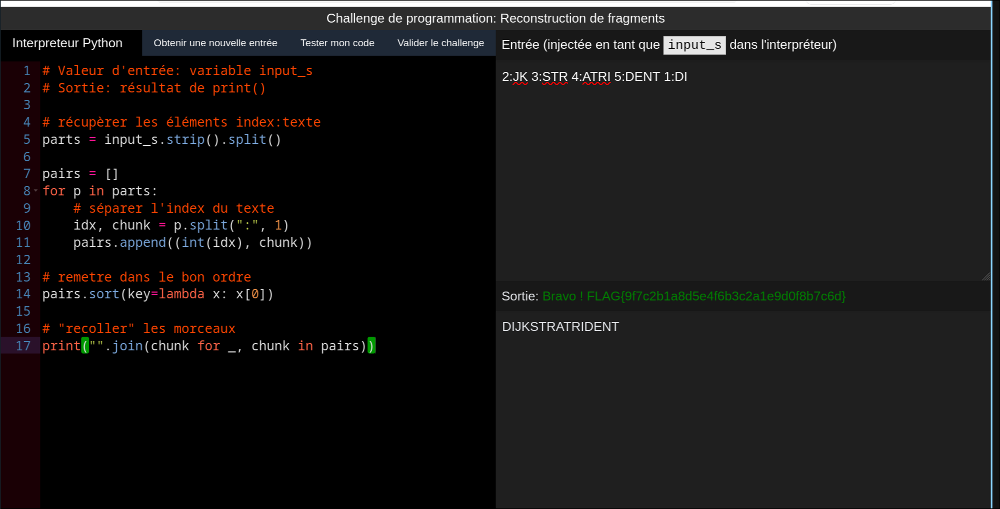

# Écho de l’Abîme - Reconstruction de fragments

# Writeup

Dans ce challenge on reçoit une entrée qui contient des morceaux de message sous la forme :

```
index:fragment
```

Les fragments arrivent dans le désordre.

L’index (un nombre) indique la position correcte du fragment dans le message final.

Objectif : trier les fragments par index, puis recoller tous les fragments sans espace pour obtenir le message final (en clair).

Exemple :

```
3:UT 1:SIGN 2:ALRO 4:E -> ordre 1-2-3-4 -> SIGN + ALRO + UT + E -> SIGNALROUTE
```

Voici le script qui permet d'obtenir le message final :

```py
# récupérer les éléments index:texte
parts = input_s.strip().split()

pairs = []
for p in parts:
    # séparer l'index du texte
    idx, chunk = p.split(":", 1)
    pairs.append((int(idx), chunk))

# remettre dans le bon ordre
pairs.sort(key=lambda x: x[0])

# "recoller" les morceaux
print("".join(chunk for _, chunk in pairs))
```

Nous pouvons valider le challenge avec :




On recupère le flag :

```
FLAG{9f7c2b1a8d5e4f6b3c2a1e9d0f8b7c6d}
```