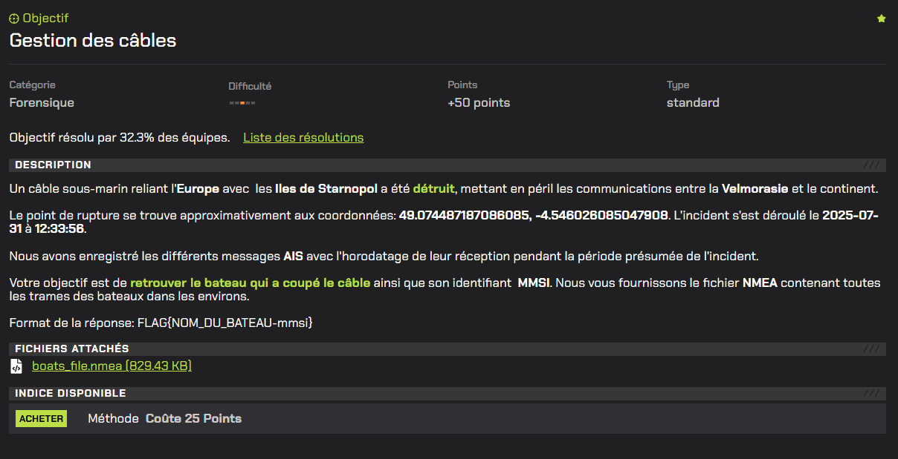
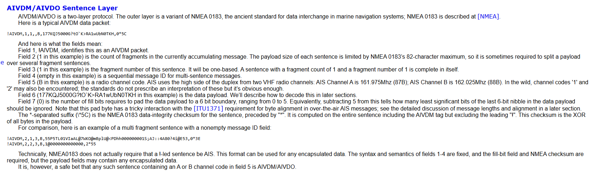
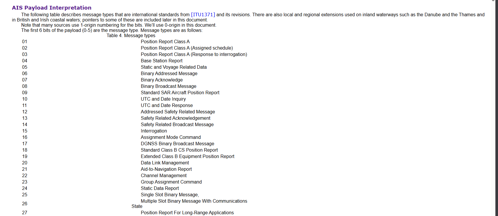
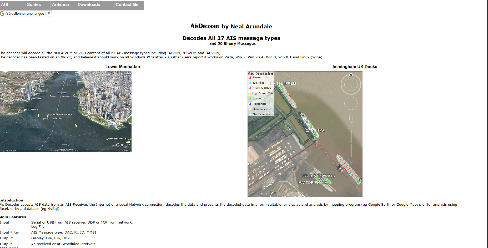
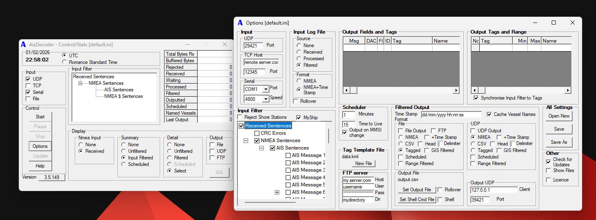
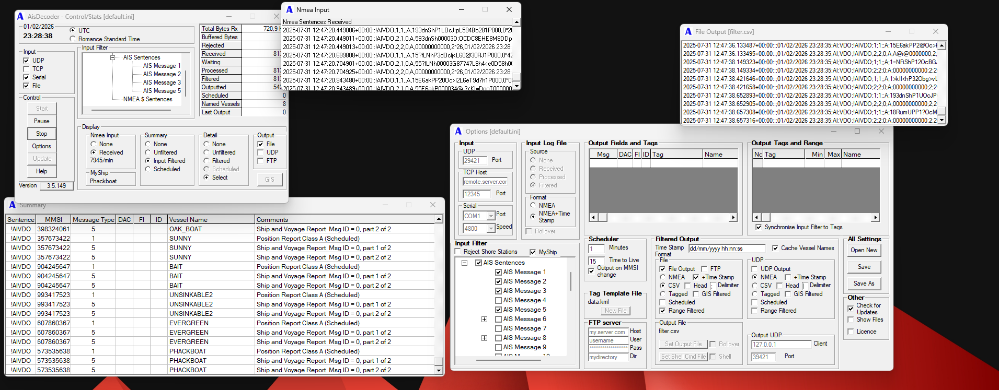
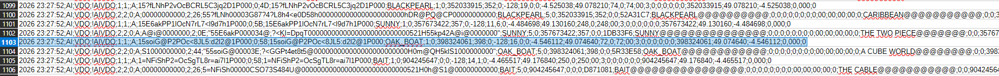

# Gestion des câbles



# Writeup

Dans ce challenge, nous disposons d'un fichier `.nema` qui contient les différents messages `AIS` pendant la période présumée de l'incident.

Nous devons d'abord nous renseigner sur ce qu'est un message `AIS` et comment le decoder. 

Voici un article qui explique un peu plus en détail le protocole [(article)](https://gpsd.gitlab.io/gpsd/AIVDM.html) :



Dans notre cas, les trames présentes dans le fichier commencent par `!AIVDO` et non `!AIVDM`.

D’après la documentation, cela signifie que les messages correspondent à des trames AIS émises par la station locale (“own vessel”).  

Le champ le plus important de la trame est le `payload`. 

Ce champ contient le message AIS encodé sous forme de caractères ASCII, chaque caractère représentant une valeur sur 6 bits.

Voici la liste complète des types de message et leur signification :



Dans le cadre de ce challenge, nous nous intéressons principalement aux messages de type 1, 2 et 3, qui fournissent la position du navire, ainsi qu’au message de type 5, qui contient les informations statiques du navire, notamment son nom.

Ensuite nous pouvons trouver assez facilement un autre article qui fournit un decoder AIS :



Voici comment il se présente :



Pour decoder les messages `AIS` et en suivant la structure au dessus, nous devons cocher en plus de ce qui l'est déjà dans l'outil :

- AIS Message 1

- AIS Message 2

- AIS Message 3

- AIS Message 5

Pour l'`Input` :

- File 

Pour l'`Output` on coche :

- CSV (facilement exploitable sous ce format)
- Head
- Time Stamp
- Pour le Delimiter, on met : `;`

Ensuite nous appuyons sur `Start` et l'outil effectue le décodage : 



Il ne nous reste qu'à ouvrir le fichier csv et chercher par rapport aux fonctions que nous avons dans la consigne.

Par exemple avec les coordonnées du point de rupture : 



Nous trouvons un bateau très proche des coordonnées du point de rupture :

```
2026 23:27:52;AI;VDO;!AIVDO;1;1;;A;15soiG@P2POc<8JL5:d2l2@1P000;0;58;15soiG@P2POc<8JL5:d2l2@1P000;OAK_BOAT;1;0;398324061;398;0;-128;16,0;0;-4.546112;49.074640;72,0;72;00;3;0;0;0;0;0;0;398324061;49.074640;-4.546112;0,000;0
```

Voici les informations de celui-ci :

Nom : `OAK_BOAT`
MMSI : `398324061`

Qui nous permettent de construire le flag :

```
FLAG{OAK_BOAT-398324061}
```