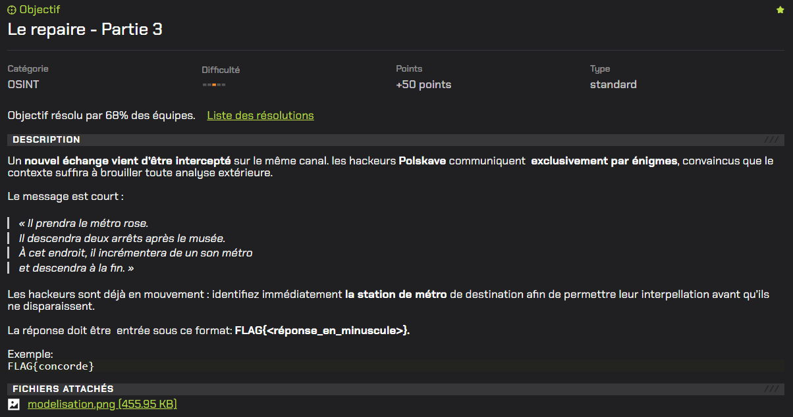
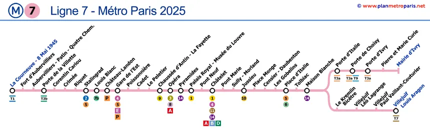
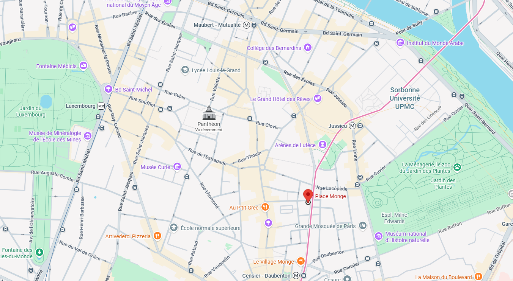
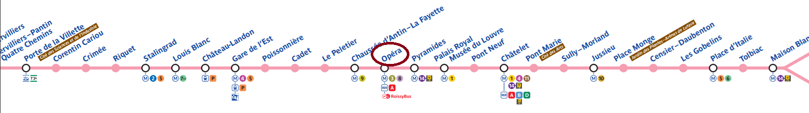
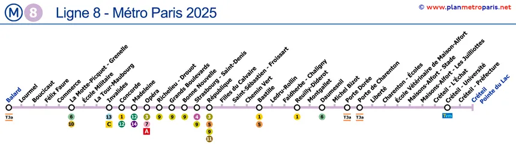

# Le repaire - Partie 3



# Writeup

Voici le message disponible  :

```
« Il prendra le métro rose.
Il descendra deux arrêts après le musée.
À cet endroit, il incrémentera de un son métro
et descendra à la fin. »
```

La première phrase nous indique quelle ligne de métro est emprunté, ici une ligne rose : 



La ligne rose à Paris est `la ligne 7`, il convient ensuite de trouver l'arrêt le plus proche du Panthéon où les hackeurs ont pu prendre le métro :



L'arrêt le plus proche du Panthéon est `Place Monge`

Ensuite, par rapport à la deuxième phrase de l'énigme, il faut trouver le nom de l'arrêt situé deux arrêts après le Musée : 



L'arrêt est `Opéra`.

La troisième phrase de l'énigme signifie qu'il faut incrémenter le numéro de la ligne de 1 : 7+1 = 8.

Les hackeurs empruntent la ligne 8.

Ils descendent ensuite "à la fin" de cette ligne :



Il y a donc deux possiblités, soit l'arrêt `Balard` soit `Créteil Pointe du Lac`

Il s'avère que le bon arrêt est `Balard` :

```
FLAG{balard}
```

