# Survivant Crescendo

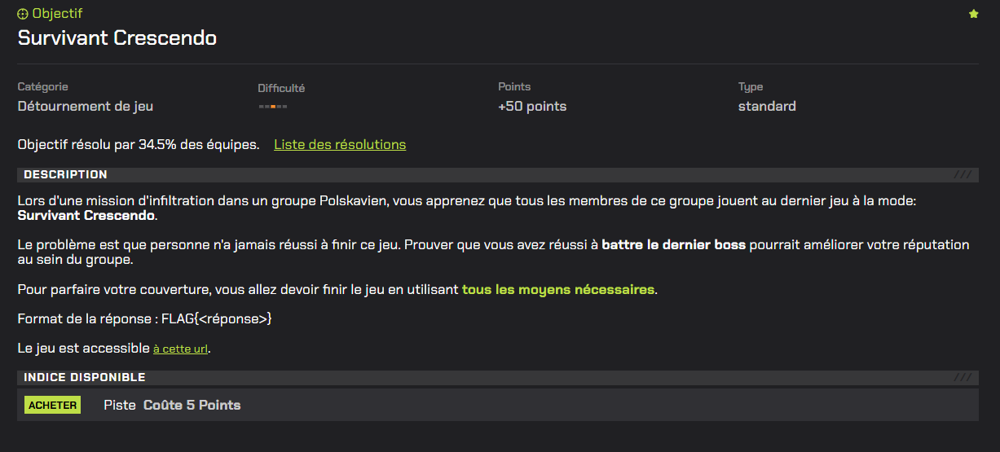

# Writeup

Le challenge fournit un jeu `WebAssembly`.

Le WASM est chargé via un module JS `crescendo.js` et le binaire `crescendo.wasm`.

Il existe deux solutions pour résoudre ce challenge :

- Gagner en trichant côté runtime (sans reverse), 
- Soit extraire le flag directement depuis le WASM.

## 1ère méthode

En inspectant le module JS , on voit une classe WASM-bindgen :

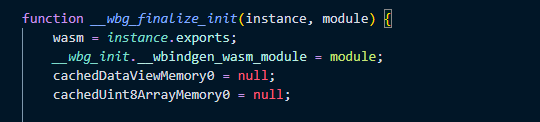

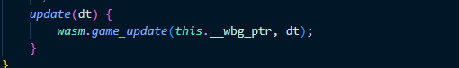

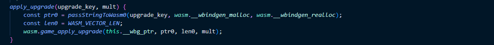

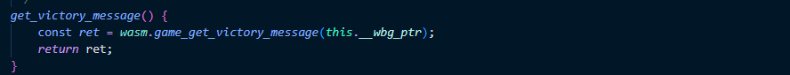

La classe `Game` appelle les exports ci-dessus.

Donc le message de victoire provient du WASM, parce que `get_victory_message()` appelle directement `wasm.game_get_victory_message(...)` et ne fait aucun traitement JS.

De même `apply_upgrade(upgrade_key, mult)` est une fonction de la classe `Game` (wrapper wasm-bindgen). Elle est appelée quand on choisit une amélioration, puis transmet la requête au WASM via `wasm.game_apply_upgrade(...)`.

Donc si on modifie ce point, on peut modifier toutes les upgrades sans avoir besoin de connaître les clés `(arpeggio, reverb, homingMelody, etc.).`

Idée : 

Quand le jeu appelle `apply_upgrade("reverb", 1)` (par exemple), nous voulons que le WASM reçoive plutôt :

`apply_upgrade("reverb", 1e5)`

Pour cela, nous pouvons utiliser la fonctionnalité `Local Overrides` de `Chrome DevTools`.

Elle permet de remplacer un fichier distant (ici `crescendo.js`) par une version locale modifiée, servie à la place de l’original.

Ici nous voulons patch la fonction `apply_upgrade` :

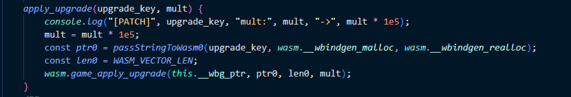

Pour vérifier que l’override est bien utilisé, on peut ajouter un `console.log` dans `apply_upgrade` : à chaque upgrade choisie, on observe la valeur originale et la valeur envoyée au WASM.

Une fois patché, il ne reste plus qu'à jouer au jeu pour gagner :

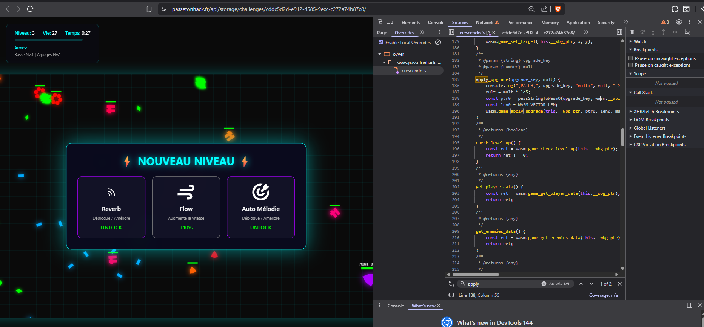

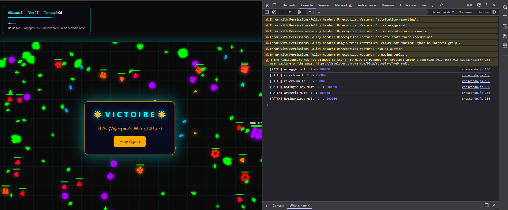

## 2ème méthode

Comme vu précédemment, le message de victoire est généré dans le WASM.

WebAssembly possède un format texte(`.wat`) et un format binaire(`.wasm`).

Nous devons donc convertir le format binaire en format texte.

Pour celà on peut utiliser l'outil [wabt](https://github.com/WebAssembly/wabt) :

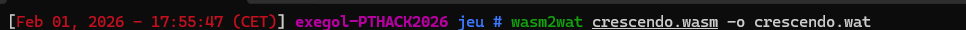

Un ```strings crescendo.wasm | grep FLAG{``` ne donne rien, celà veut dire que  :

- soit le flag est chiffré/obfusqué
- soit il est généré dynamiquement
- soit il est récupéré depuis le réseau (mais ici, il est retourné par `game_get_victory_message` → donc interne au binaire).

Par expérience de mes précédents `CTF`, le plus fréquent pour cacher une string dans un binaire (WASM compris) c’est :

- XOR avec une clé (simple et léger)
- addition/soustraction (Caesar)
- table de substitution
- base64 + decode

`XOR` va être le pattern qui va se révéler être le bon.

### Rappel : qu’est-ce qu’un XOR ?

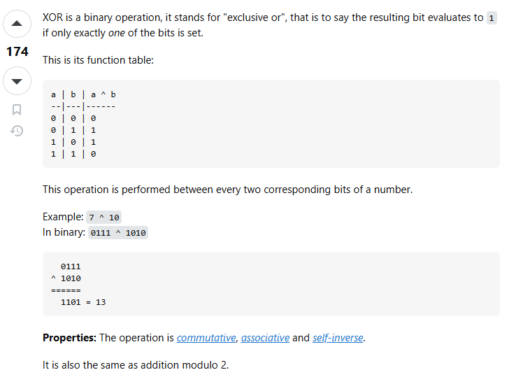

Le XOR (opérateur `^`) est une opération binaire qui vaut 1 si les bits sont différents, et 0 s’ils sont identiques.
Sa propriété intéressante en obfuscation est qu’il est réversible :

```
A XOR K = B

B XOR K = A (car XOR avec la même clé annule l’opération)
```

Donc si le flag est stocké sous forme “chiffrée” cipher, on peut récupérer le texte clair en faisant :
```plain[i] = cipher[i] XOR key[i].```

Le flag est une chaîne de caractères, donc si une obfuscation XOR est utilisée “octet par octet”, on s’attend à voir dans le .wat un schéma du type :

```
lecture d’un octet : i32.load8_u

application d’un XOR avec une constante : i32.const … puis i32.xor

écriture de l’octet : i32.store8
```
Ressource pour mieux comprendre [WebAssembly memory instructions](https://developer.mozilla.org/en-US/docs/WebAssembly/Reference/Memory/load) - [WebAssembly numeric instructions](https://developer.mozilla.org/en-US/docs/WebAssembly/Reference/Numeric/xor)

Et, en effet c'est le cas, mais avec un peu de chance la clé est peut être en clair sous forme ASCII ? 

Pour le savoir, nous pouvons essayer d'extraire toutes les constantes de XOR et les convertir en ASCII : 

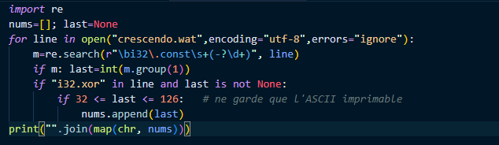

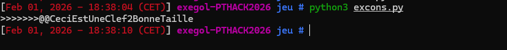

Parmi les caractères ASCII extraits, on repère une sous-chaîne entièrement lisible : `CeciEstUneClef2BonneTaille`. On la considère comme la clé XOR.

Avoir la clé ne suffit pas, maintenant il nous faut aussi récupérer les octets chiffrés.

Il faut donc repérer la boucle XOR “octet par octet” dans le .wat

Et remonter juste au-dessus où on trouve l’initialisation du buffer chiffré via des `store*`

On commence par lister toutes les occurrences de i32.xor :

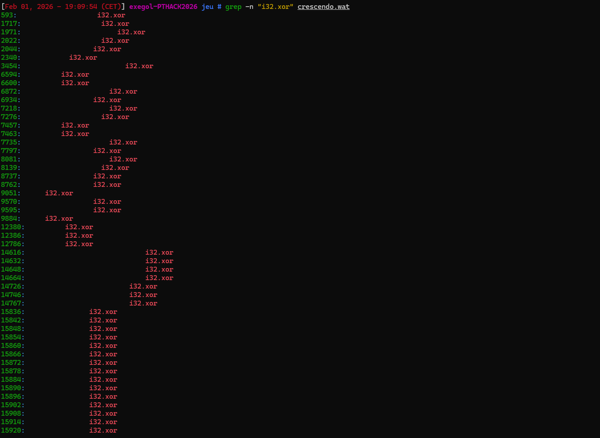

Il y en a beaucoup, donc on cherche celle qui ressemble à un XOR sur une chaîne.

On tombe alors sur une suite répétée :

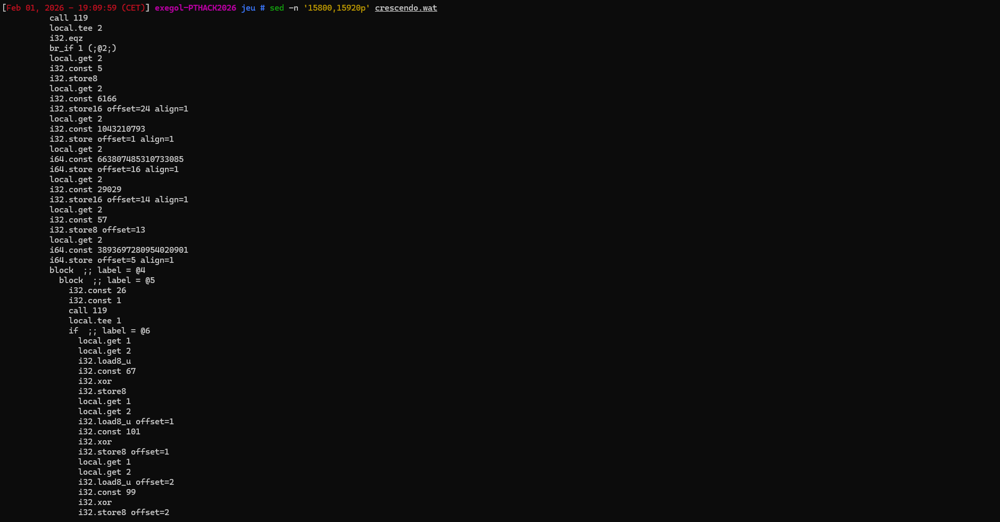

Les constantes `67, 101, 99, 105,`  correspondent à `C, e, c, i,` -> on retrouve bien notre clé ASCII `CeciEstUneClef2BonneTaille`.

On a donc identifié la routine de déchiffrement : `plain[i] = cipher[i] XOR key[i].`

Juste avant la boucle XOR, le WASM remplit un buffer en mémoire (pointeur stocké dans `local 2`) avec une série de `store*` :

```
store8 : 1 octet

store16 : 2 octets

store : 4 octets

i64.store: 8 octets
```

Chaque instruction possède un `offset=` qui indique où écrire dans le buffer.

Extrait :

```wat
local.get 2
i32.const 5
i32.store8

local.get 2
i32.const 1043210793
i32.store offset=1 align=1

local.get 2
i64.const 3893697280954020901
i64.store offset=5 align=1

local.get 2
i32.const 57
i32.store8 offset=13

local.get 2
i32.const 29029
i32.store16 offset=14 align=1

local.get 2
i64.const 663807485310733085
i64.store offset=16 align=1

local.get 2
i32.const 6166
i32.store16 offset=24 align=1
```

- cipher[0] = 5 (store8 sans offset ⇒ offset 0)

- cipher[1:5] = 1043210793 sur 4 octets (little-endian)

- cipher[5:13] = 3893697280954020901 sur 8 octets (little-endian)

- cipher[13] = 57

- cipher[14:16] = 29029 sur 2 octets (little-endian)

- cipher[16:24] = 663807485310733085 sur 8 octets (little-endian)

- cipher[24:26] = 6166 sur 2 octets (little-endian)

WebAssembly écrit les valeurs multi-octets en mémoire en little-endian.

Exemple : `i32.store offset=1` écrit 4 octets en little-endian, donc la valeur est à convertir en bytes et placée dans `cipher[1:5]`.

Pour reconstruire correctement `cipher`, il faut donc convertir chaque constante en bytes little-endian :

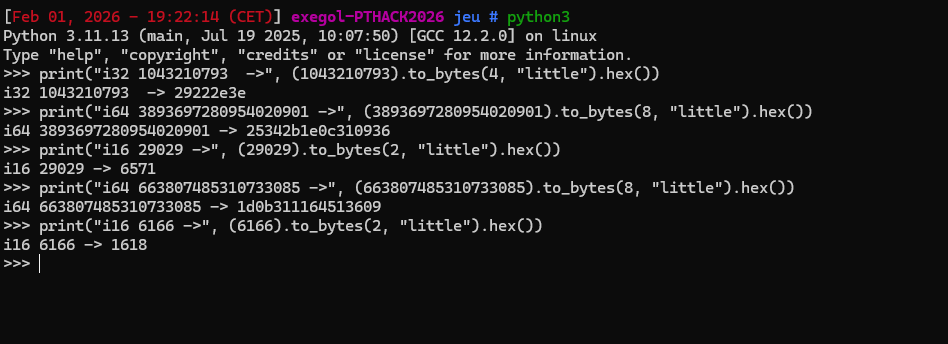

Maintenant, il ne reste plus qu'à appliquer :


```plain[i] = cipher[i] XOR key[i]```

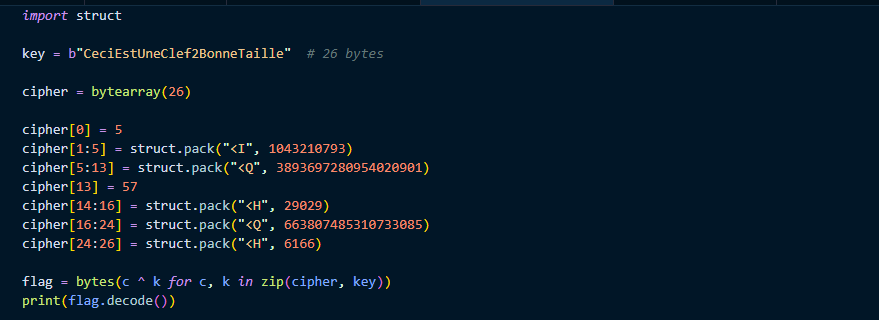

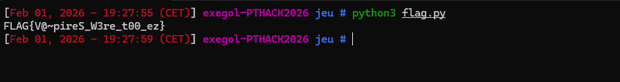

```
FLAG{V@~pireS_W3re_t00_ez}
```