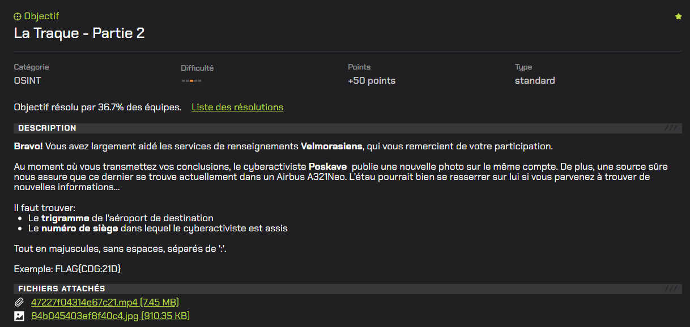
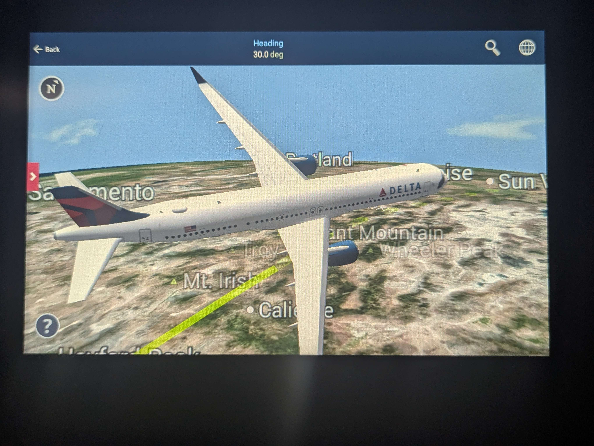
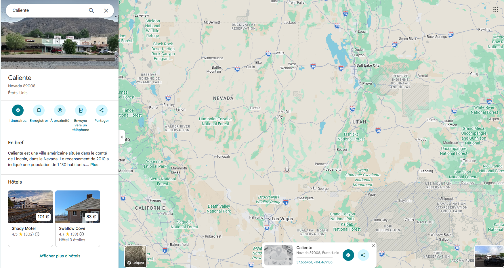
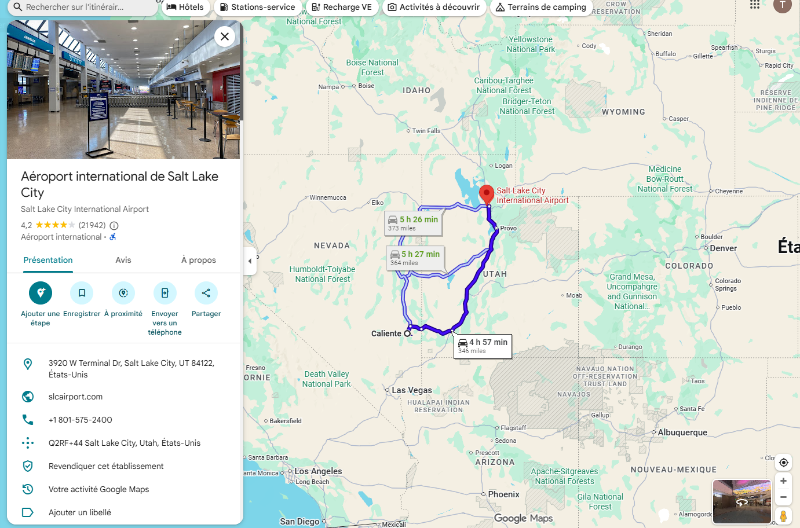
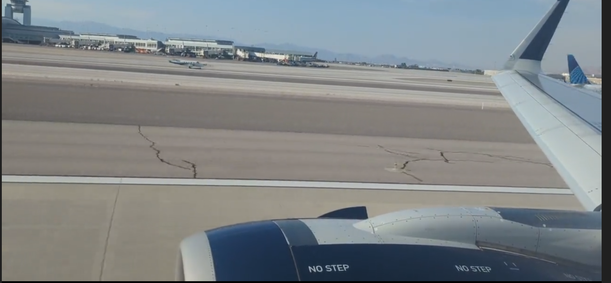
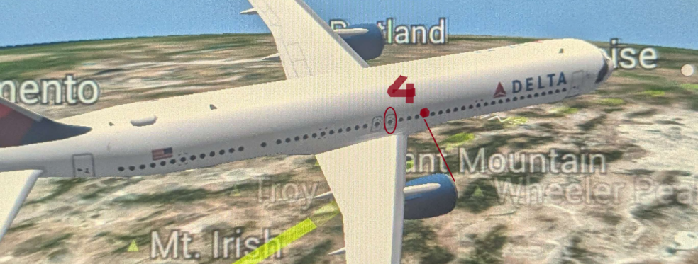
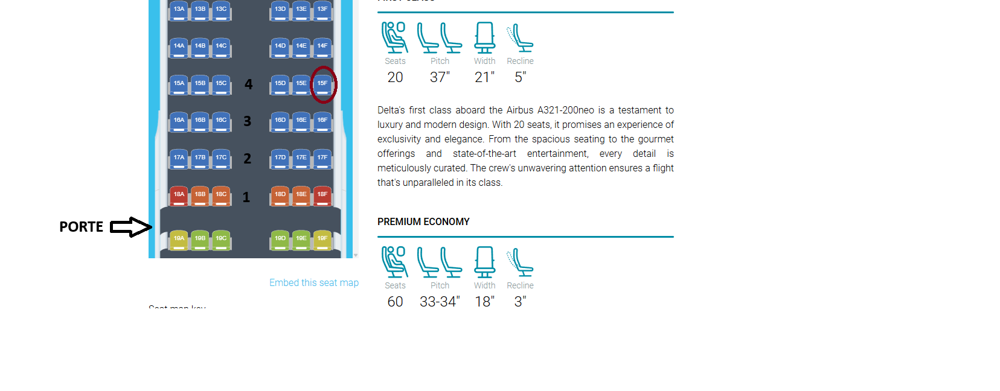

# La Traque - Partie 2



# Writeup

Dans cette deuxième partie du challenge, nous avons un nouvel élement qui va nous permettre de trouver le trigramme de l'aéroport de destination : 



Comme précisé dans l'énoncé du challenge, nous pouvons voir sur cette image un `Airbus A321Neo` de la compagnie `Delta`.

Cet avion se situe au dessus du Nevada :




Précisement au sud-est du Nevada car on lit clairement les villes `Caliente` et `Mt.Irish`.

Ensuite on voit également le cap en haut : `Heading 30.0°`

--> 30° = `Nord-Nord-Est`

Avec tous ces indices on peut demander à une IA générative de nous donner l'aéroport qui peut correspondre, l'aéroport le plus probable avec ces détails est, selon `ChatGPT` 
`Salt Lake City` (trigramme = SLC)



Ensuite nous devons trouver le numéro de siège dans lequel est assis le cyberactiviste.

L'indice clé est le modèle de l'appareil donné dans l'énoncé : un `Airbus A321Neo`.

Pour rappel le cyberactiviste filme depuis le hublot à l'avant du réacteur droit :



Celui ci est à 4 rangées de la porte du milieu de l'avion :



Le site [seatmap](https://seatmaps.com/airlines/dl-delta/airbus-a321neo/) permet d'avoir le plan des sièges de chaque type d'appareil en fonction de la compagnie, dans notre cas `Delta Airbus A321neo aircraft seat map`.

La prochaine est dernière étape est de situer la porte centrale de l'avion, de compter 4 rangées et de prendre sur cette 4ème rangée le hublot le plus à droite de l'avion :



Le numéro de siège est `15F`.

Nous pouvons reconstituer le flag :

```
FLAG{SLC:15F}
```

