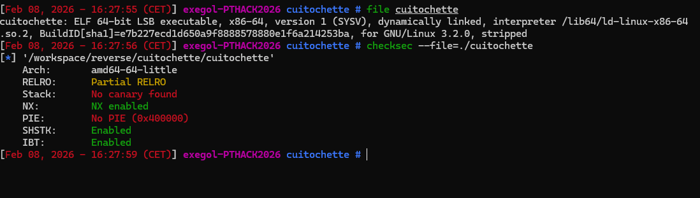
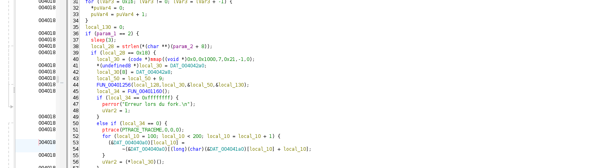
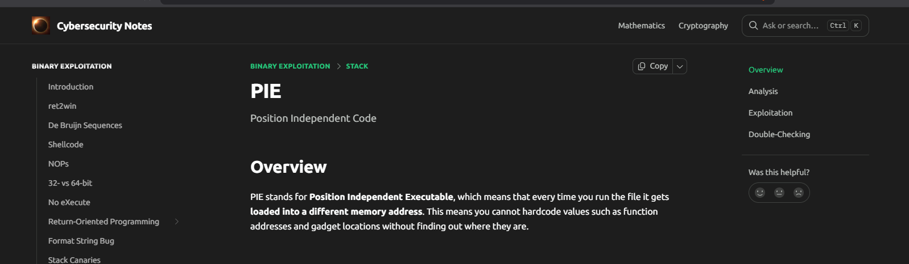
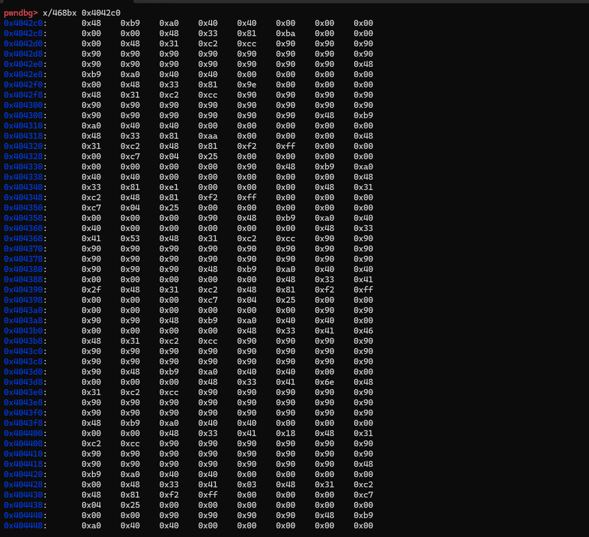
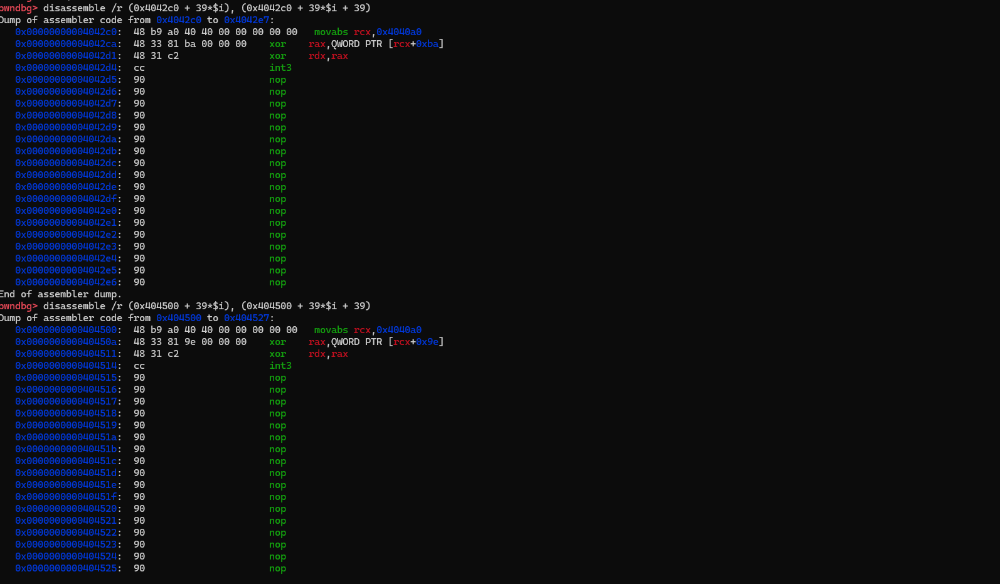

# Cuitochette

# Writeup



Le binaire est un ELF 64-bit x86-64 dynamiquement lié et strippé, et d’après checksec il a NX activé, pas de PIE (adresses fixes), pas de canary, avec Partial RELRO et les protections CET (SHSTK/IBT) activées.

## Comportement du binaire - Fonction Principale

Le programme attend un unique argument, et répond simplement :

```zsh
[Feb 08, 2026 - 17:42:03 (CET)] exegol-PTHACK2026 cuitochette # ./cuitochette                                           
Utilisation: program <argument>
[Feb 08, 2026 - 17:42:09 (CET)] exegol-PTHACK2026 cuitochette # ./cuitochette AAAA
Mauvais mot de passe ...
[Feb 08, 2026 - 17:43:04 (CET)] exegol-PTHACK2026 cuitochette #
```

Une première exécution strace montre aussi un délai volontaire avant l’affichage :

```zsh
strace -f ./cuitochette AAAA
# ...
clock_nanosleep(CLOCK_REALTIME, 0, {tv_sec=3, tv_nsec=0}, 0x7ffdc1d33a10) = 0
newfstatat(1, "", {st_mode=S_IFCHR|0620, st_rdev=makedev(0x88, 0), ...}, AT_EMPTY_PATH) = 0
getrandom("\x22\xe4\x8f\xd9\xb8\x99\x9a\xc8", 8, GRND_NONBLOCK) = 8
brk(NULL)                               = 0x339a1000
brk(0x339c2000)                         = 0x339c2000
write(1, "Mauvais mot de passe ...\n", 25Mauvais mot de passe ...
) = 25
exit_group(1)                           = ?
+++ exited with 1 +++
```

En analyse statique, on peut remarquer que le binaire calcule directement la longueur de l’argument :



- Le binaire récupère `argv[1] via *(char **)(param_2 + 8)`, calcule sa longueur avec strlen, puis compare le résultat à `0x18 (24)`

- Si la longueur est différente, il sort immédiatement en affichant “Mauvais mot de passe …”.

Cela explique pourquoi une entrée courte (`AAAA`) ne déclenche aucune logique avancée.

L'argument doit donc faire 24 caractères.

## Fonction principale

Le binaire est stripped, donc Ghidra nomme la fonction principale `FUN_00401338`. En lisant le pseudo-code, on voit que la vérification du mot de passe se fait en plusieurs étapes.

La fonction commence par vérifier qu’on a bien un seul argument utilisateur (donc `argc == 2`). Sinon, elle affiche l’usage :

```c
if (param_1 == 2) {
    sleep(3);
    [...]
} else {
    puts("Utilisation: program <argument>");
}
```

Ensuite, la longueur de l’argument est calculée puis comparée à `0x18` comme vu juste ci-dessus.

Si la longueur est correcte, le programme alloue une page mémoire exécutable :

```c
local_30 = (code *)mmap((void *)0x0,0x1000,7,0x21,-1,0);
```

Le paramètre `7` signifie : `PROT_READ | PROT_WRITE | PROT_EXEC.`

Donc le programme prépare du code en mémoire , puis l’exécute c’est typique d’un shellcode/JIT.

On voit d’ailleurs que le programme initialise la page `RWX` avec quelques `octets/constants` (au moins 16 bytes visibles dans le pseudo-code), puis appelle `FUN_00401256` qui copie/compose le reste du code exécuté (patch JIT / déchiffrement / assemblage). L’exécution réelle se fait ensuite via `(*local_30)()` :

```c
*(undefined8 *)local_30 = DAT_004042a0;
local_30[8] = DAT_004042a8;
FUN_00401256(local_128,local_30,&local_50,&local_130);
```

> Le binaire utilise une technique d'**anti-debugging** sophistiquée basée sur `fork()` + `ptrace()`.

Le programme crée un enfant via un appel de type `fork()` (dans strace, on le voit souvent sous la forme de `clone()`) :

```c
local_34 = FUN_00401160();
```
Puis deux branches :

Branche enfant `(local_34 == 0)`

L’enfant indique qu’il accepte d’être tracé par son parent (`PTRACE_TRACEME`) :

```c
ptrace(PTRACE_TRACEME,0,0,0);
```

Il modifie ensuite une table en mémoire sur la plage **[100..199]** :

```c
for (local_10 = 100; local_10 < 200; local_10 = local_10 + 1) {
  (&DAT_004040a0)[local_10] =
      ~(&DAT_004040a0)[(long)(char)(&DAT_004041a0)[local_10] + local_10];
}
```

Puis il exécute le code dynamique :

```c
uVar2 = (*local_30)();
```

Donc l’enfant correspond à la table transformée + exécution du shellcode.

Branche parent `(local_34 != 0)`

Le parent attend l’enfant et va ensuite le "contrôler" :

```c
waitpid(local_34,(int *)&local_134,0);
```

Le parent initialise un tableau (`local_158`) qui servira de résultat transformé et charge une valeur cible `s2` directement dans le code :

```c
local_158[...] = 0;
local_178 = 0x9a92983533f33101;
local_170 = 0x716453c4e362380a;
local_168 = 0x2007bc8c58bc9342;
```

Ensuite il parcourt l’entrée de 2 en 2 :

```c
local_20 = 0;
while ((local_20 < local_28 && (local_11 == '\0'))) {
    ...
    local_20 = local_20 + 2;
}
```

Comme `local_28 = 24` cela fait 12 itérations donc 12 paires de caractères.

A chaque itération il :

- récupère les registres du child (`PTRACE_GETREGS`)

- lit les deux caractères `argv[1][i]` et `argv[1][i+1]`

- injecte ces deux octets dans les registres du child (via `PTRACE_GETREGS`-> modification de la struct regs -> `PTRACE_SETREGS`) pour que le shellcode les traite

- relance l’enfant (`PTRACE_CONT`) et attend un signal

- selon le signal, applique une transformation différente

```c
local_44 = (int)local_134 >> 8 & 0xff;
if (local_44 == 5) {  // SIGTRAP
  local_158[local_20] = (byte)local_d8;
  local_158[local_20 + 1] =
      (byte)local_c8 ^
      (&DAT_004040c8)[local_20 + (long)(char)(&DAT_004041a1)[local_20]];
} else {              // sinon (autre signal très probablement SIGSEGV)
  local_158[local_20] =
      (&DAT_004040c7)[local_20 + (long)(char)(&DAT_004041a0)[local_20]] ^
      (byte)local_d8;
  local_158[local_20 + 1] = (byte)local_c8;
}
```

Le code récupère le signal renvoyé par waitpid via le champ status (encodé) :

```
status & 0xff == 0x7f -> l’enfant est stoppé (équivalent WIFSTOPPED(status))

((status >> 8) & 0xff) -> numéro du signal (équivalent WSTOPSIG(status)), donc 5 == SIGTRAP
```

Il extrait le numéro du signal stoppant l’enfant, puis compare à 5 (SIGTRAP).

On voit que :

- Si SIGTRAP : le 1er octet est pris “tel quel” et le 2e est x-oré. 
- Sinon : le 2e octet est pris “tel quel” et le 1er est x-oré.

Enfin le résultat `local_158` (`24 octets`) est comparé à la cible (`24 octets`) :

```c
if ((local_11 != '\0') && (memcmp(local_158, &local_178, 0x18) == 0)) {
    puts(&DAT_00402058);
    return 0;
}
puts("Mauvais mot de passe ...");
```

- `local_158` = buffer transformé (`s1`)

- `&local_178` = constante hardcodée (`s2`)

- `memcmp(local_158, &local_178, 0x18)` = comparaison finale sur 24 bytes

## Extraction manuelle des tables en mémoire

Pour pouvoir reproduire (ou inverser) l’algorithme de vérification, il faut récupérer les différentes tables utilisées dans les opérations `XOR`.

On les retrouve dans les index de type :

```c
(&DAT_004040c7)[i + (char)(&DAT_004041a0)[i]] ou (&DAT_004040c8)[i + (char)(&DAT_004041a1)[i]]
``` 

```c
DAT_004040c7 = byte_4040A0 + 0x27

DAT_004040c8 = byte_4040A0 + 0x28

DAT_004041a1 = byte_4041A0 + 1
```

Dans la boucle du parent.

Or dans le pseudo-code, ces tables apparaissent sous forme de variables globales `DAT_004040a0` et `DAT_004041a0`.

Comme le binaire n’est pas PIE :



Les adresses sont fixes : les tables sont donc toujours aux mêmes adresses en mémoire ce qui permet de les dumper facilement.

On utilise les commandes suivantes pour lire directement la mémoire :

```gdb
x/256bx 0x4040a0
x/256bx 0x4041a0
```

- `x` : examine memory

`/256` : lire 256 valeurs

- `b` : lecture octet par octet

- `x` : affichage hexadécimal

Cela permet de récupérer les deux tableaux complets :

`byte_4040A0` : table de `lookup` de 256 octets

`byte_4041A0` : table `d’offsets` de 256 octets

Ces deux tables sont utilisées dans les calculs d’index lors des XOR notamment dans la boucle du parent et dans la transformation réalisée par l’enfant.

## Extraction de la valeur cible (s2)

La valeur cible comparée à la fin correspond à 24 octets stockés dans trois variables `64-bit` :

```c
local_178 = 0x9a92983533f33101;
local_170 = 0x716453c4e362380a;
local_168 = 0x2007bc8c58bc9342;
```

En prenant en compte le format little-endian on obtient la séquence de bytes suivante :

```r
01 31 f3 33 35 98 92 9a
0a 38 62 e3 c4 53 64 71
42 93 bc 58 8c bc 07 20
```

Cette valeur correspond au buffer `s2` attendu lors de la comparaison finale.

## Identification des shellcodes dynamiques

Le binaire utilise également deux zones mémoire contenant des blocs de code, utilisées comme shellcodes :

`0x4042C0`: shellcodes `TRUE`

`0x404500` : shellcodes `FALSE`

Il y a 12 blocs dans chaque zone, ce qui correspond aux 12 paires (24 caractères) du mot de passe.

Comme chaque zone contient 12 × 39 = 468 octets, on peut les dumper ainsi :

```gdb
x/468bx 0x4042c0
x/468bx 0x404500

(car 12 × 39 = 468)
```



Désassemblage d’un bloc (39 octets)

Pour comprendre ce que fait un bloc, il faut le désassembler sur exactement 39 octets.

On fixe d’abord l’index du bloc :

```
set $i = 0
```

Puis on désassemble le bloc `i` (TRUE puis FALSE) en bornant explicitement la plage :

```
disassemble /r (0x4042c0 + 39*$i), (0x4042c0 + 39*$i + 39)
disassemble /r (0x404500 + 39*$i), (0x404500 + 39*$i + 39)
```


L’option `/r` affiche les opcodes en plus des instructions, ce qui est pratique pour repérer certains motifs (ex : `0xCC`). 

## Propriétés des shellcodes    

En regardant le désassemblage d’un bloc (39 octets), on remarque qu’ils se ressemblent tous :

Ils préparent une base, font 1–2 opérations sur `RAX/RDX`, puis forcent un arrêt (`SIGTRAP via int3 ou faute mémoire`).

Exemple : `bloc i = 0` (TRUE puis FALSE)

Dans la capture ci dessus on voit :

```gdb 
movabs rcx, 0x4040a0 -> charge l’adresse de byte_4040A0 (table de lookup)
xor rax, QWORD PTR [rcx+0xba] (TRUE) -> offset = 0xBA (c’est la constante importante du bloc)
xor rax, QWORD PTR [rcx+0x9e] (FALSE) -> offset = 0x9E
xor rdx, rax -> mélange RDX et RAX (le 2e octet dépend du 1er)
int3 (opcode 0xCC) -> arrêt volontaire du child → SIGTRAP
```

Le reste n’est que du nop (padding) pour compléter les 39 octets.

Remarque : l’instruction lit un `QWORD` (qword ptr [...]), mais dans la suite le parent caste en byte.

Au final seuls les octets bas sont utilisés. Donc, pour l’offset, on peut raisonner comme si le bloc utilisait `byte_4040A0[offset]`.

## Comment reconnaître le signal (TRAP vs faute / SEGV)

- Si le bloc contient `int3` (opcode 0xCC) → il provoque SIGTRAP (signal `5`).
- Sinon, le bloc finit en provoquant une faute (souvent un accès mémoire invalide) → observée comme `SIGSEGV` (signal `11`).

De plus certains blocs appliquent un “flip” sur `RDX`. On le repère en cherchant une instruction du style :

```
xor dl, 0xff / xor edx, 0xff

ou

not dl / not edx
```

Si elle est présente -> xor_ff = true, sinon -> false.

Pour résumer : 

Pour chaque paire `i` (0 à 11), et pour `TRUE/FALSE`, on note :

```
offset : la constante dans [rcx+0x..]

signal : TRAP si int3 (0xCC), sinon SEGV

xor_ff : présence d’un flip sur RDX
```