# Session Sécurisée Hostile

# Writeup

Dans ce challenge nous avons une archive `build.zip` :

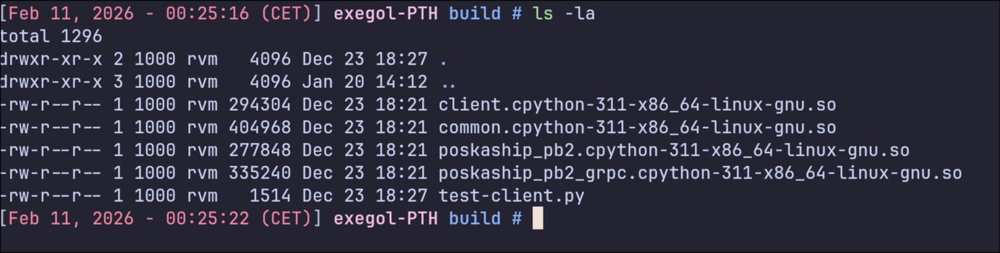

## Archive

Le `build.zip` contient :

```
- test-client.py (script de test)

- client.cpython-311-x86_64-linux-gnu.so

- common.cpython-311-x86_64-linux-gnu.so

- poskaship_pb2.cpython-311-x86_64-linux-gnu.so

- poskaship_pb2_grpc.cpython-311-x86_64-linux-gnu.so
```

Le suffixe cpython-311-x86_64-linux-gnu indique que :

- c'est module binaire pour `CPython 3.11`

- avec une architecture `x86_64 Linux`

On vérifie :

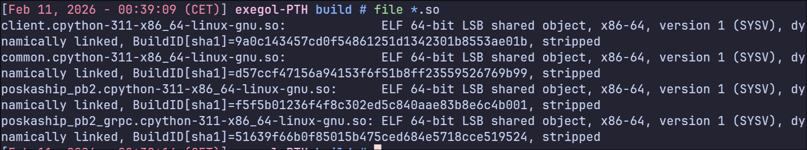

Chaque `.so` est identifié comme :

```
ELF 64-bit LSB shared object, x86-64, ... stripped
```

Définition d'un module :

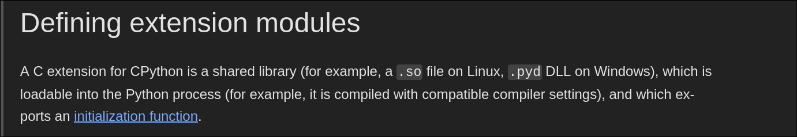

Et côté `python` :

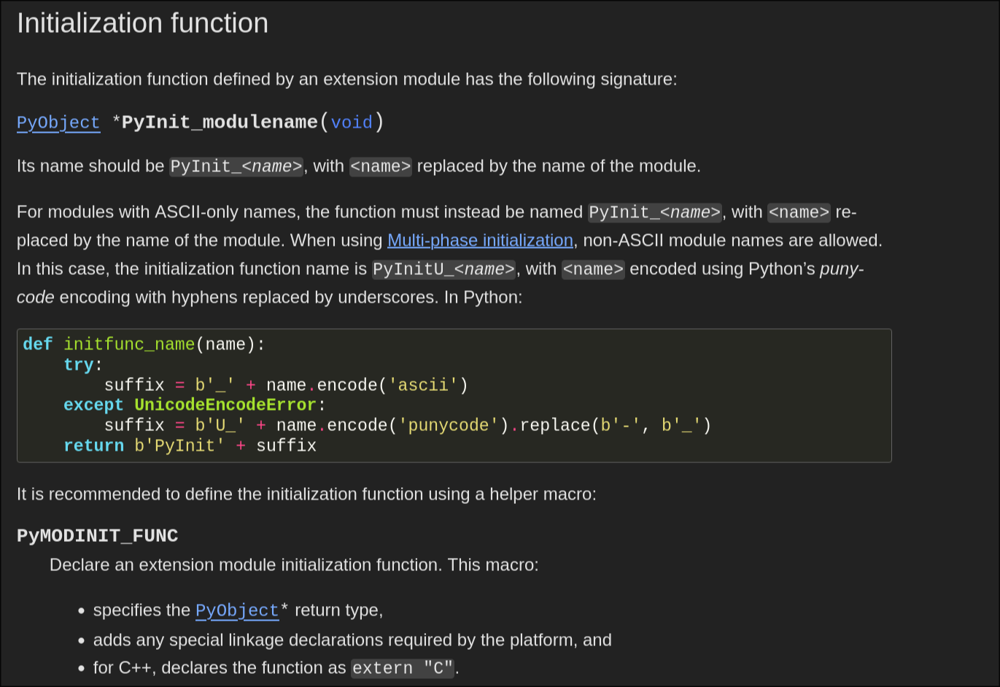

Un module natif est justement une shared library chargeable qui exporte une fonction d’init `PyInit_<nom>`.

On pourrait utiliser l'outil `nm` qui liste les symboles d’un binaire ELF : `fonctions, variables globales, noms exportés, etc.`

L’option `-D` de l'outil signifie  “liste uniquement les symboles dynamiques” (les symboles exportés que d’autres binaires/modules pourraient appeler).

Mais cette option ne montre presque que PyInit_* parce que les .so sont stripped : les symboles internes ont été retirés, et il ne reste que les symboles dynamiques indispensables, notamment le point d’entrée CPython `PyInit_<module>`.

Ce qui confirme que ce sont des modules Python importables mais rend le reverse basé sur les symboles beaucoup moins efficace.

## Script de test

Le fichier `test-client.py` est le seul fichier lisible du ZIP. 

Il sert de client pour tester la connexion au service distant.

Voici le script :

```py
#! /usr/bin/env python3

import argparse
import logging
import os
import sys

import grpc

from client import create_client_channel, PoskaShipStub
from common import message_to_dict

logging.basicConfig(
    stream=sys.stderr,
    format='[%(asctime)s] %(name)s - %(levelname)s - %(message)s',
    level=getattr(logging, os.environ.get('LOG_LEVEL', 'INFO').upper())
)
logger = logging.getLogger(os.path.splitext(os.path.basename(__file__))[0])


def main():
    """
    Entry point for script, see `--help` for usage
    """
    def parse_args():
        parser = argparse.ArgumentParser(formatter_class=argparse.ArgumentDefaultsHelpFormatter)
        parser.add_argument('remote', nargs='?', default='www.passetonhack.fr')
        args = parser.parse_args()
        return args

    args = parse_args()
    logger.debug('args = %r', args)
    try:
        with create_client_channel(args.remote, tls=True) as cc:
            stub = PoskaShipStub(*cc)
            me = stub.Me()
            print('me = ', message_to_dict(me))

    except grpc.RpcError as rpc_error:
        logger.error("Received error: %s", rpc_error)
    except Exception as e:
        te = type(e)
        show_bt = logger.getEffectiveLevel() <= logging.DEBUG
        logger.error(
            'Caught exception %s.%s: %s',
            te.__module__, te.__name__, str(e), exc_info=show_bt
        )
        return 1
    else:
        return 0


if __name__ == '__main__':
    sys.exit(main())
```

- Le script prend en argument optionnel une cible (remote), par défaut : `www.passetonhack.fr`

- Il initialise un système de logs (niveau configurable via la variable d’environnement LOG_LEVEL)

- Il ouvre une connexion `gRPC` vers la cible via :

```py
create_client_channel(remote, tls=True)
```

donc un channel `gRPC` sécurisé (`TLS`)

- Il instancie le client gRPC du service avec :

```py
PoskaShipStub(*cc)
```

Il appelle la méthode RPC :

```py
Me()
```

qui sert à récupérer les informations de l’utilisateur courant / session courante

- Il convertit la réponse protobuf en format lisible (`dict`) grâce à :

```py
message_to_dict(me)
```

- Puis affiche le résultat sous forme lisible :

```py
me = {...}
```

- Il gère les erreurs gRPC classiques avec :

```py
grpc.RpcError (erreurs réseau, serveur, auth, etc.)
```

- Il gère aussi toute autre exception Python générique en affichant :

- le type d’erreur

- le message

- et éventuellement la stacktrace si le log est en DEBUG

## Protocole gRPC

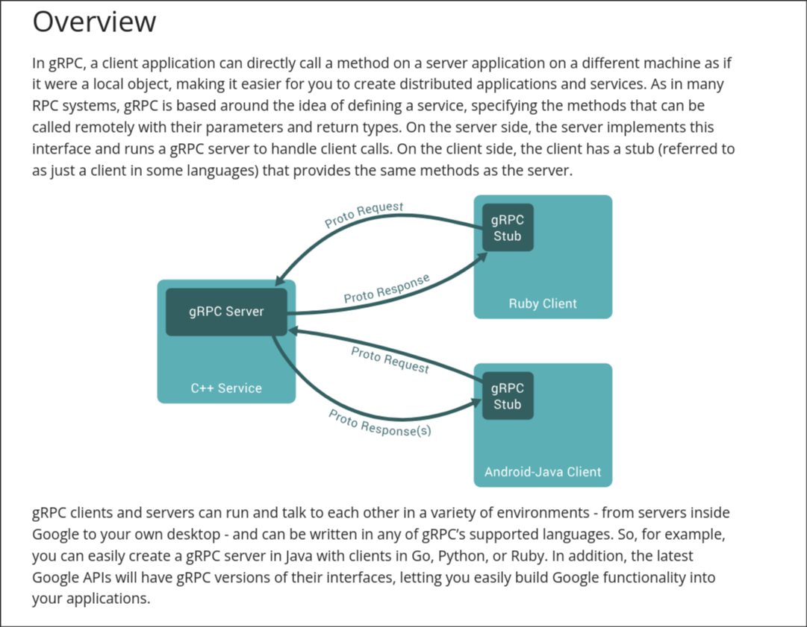

(Ressources : [grpc.io](https://grpc.io/docs/what-is-grpc/introduction/) - [ibm](https://www.ibm.com/fr-fr/think/topics/grpc))

gRPC est un framework d’appel de procédure à distance (RPC) open source, multiplateforme et indépendant du langage, qui repose sur HTTP/2 comme protocole de communication.
Initialement développé par Google, il est aujourd’hui maintenu par la Cloud Native Computing Foundation (CNCF).

Dans un rpc le client ne parle pas directement au serveur en HTTP “classique”, il utilise un `stub` généré à partir d’un fichier `.proto`, qui lui fournit les mêmes méthodes que le serveur.

### Protocol Buffers

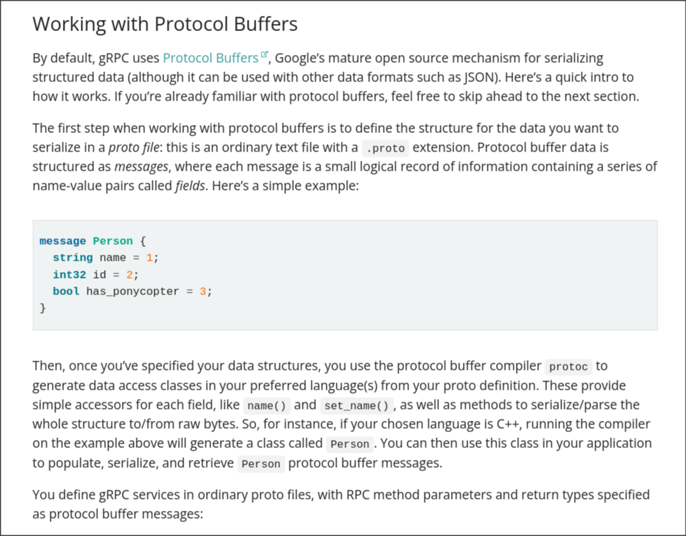
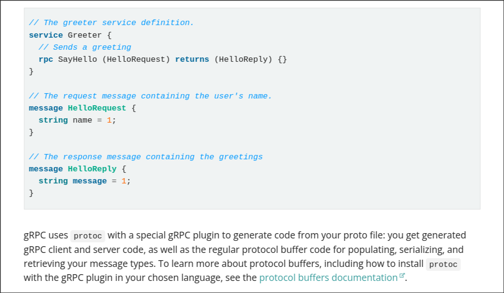

gRPC utilise par défaut Protocol Buffers (Protobuf) pour sérialiser les données échangées entre le client et le serveur.

Les structures sont définies dans un fichier `.proto` sous forme de message :


```proto
message Person {
  string name = 1;
  int32 id = 2;
  bool has_ponycopter = 3;
}
```

Chaque champ possède :

- un type

- un nom

- un numéro unique (field number)

Ce numéro est utilisé lors de la sérialisation binaire et ne doit jamais être modifié.

Une fois le fichier `.proto` défini, le compilateur `protoc` génère automatiquement les classes correspondantes dans le langage cible (ici Python).

## Lien challenge

Dans ce challenge, les fichiers `poskaship_pb2` et `poskaship_pb2_grpc` sont justement les modules générés à partir du fichier .proto original.

Le module `pokaship_bp2` contient un object DESCRIPTOR qui décrit tout le schéma (messages, champs, enums, services). Les descripteurs sont la base de la réflexion Protobuf :

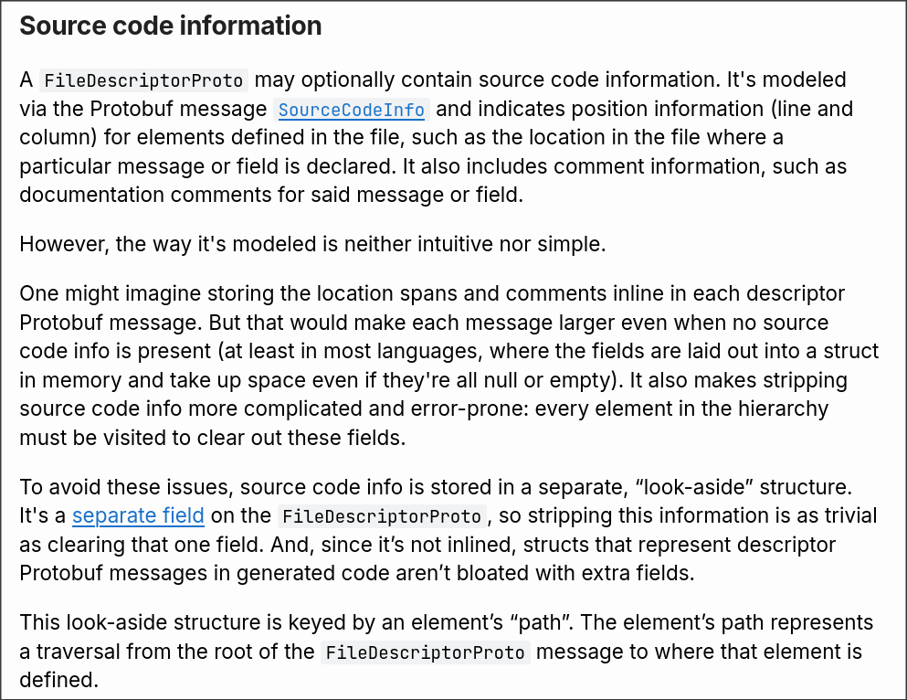

## Etapes pour récupérer le descriptor

On se place dans le dossier où sont les `.so` puis :

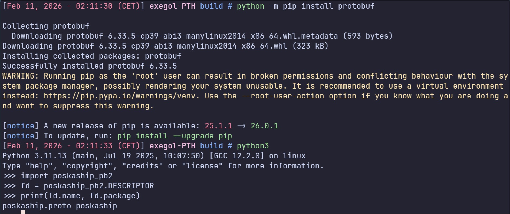 

Cela nous donne le nom du proto original et le package.

Ensuite on liste les messages/enums/services :

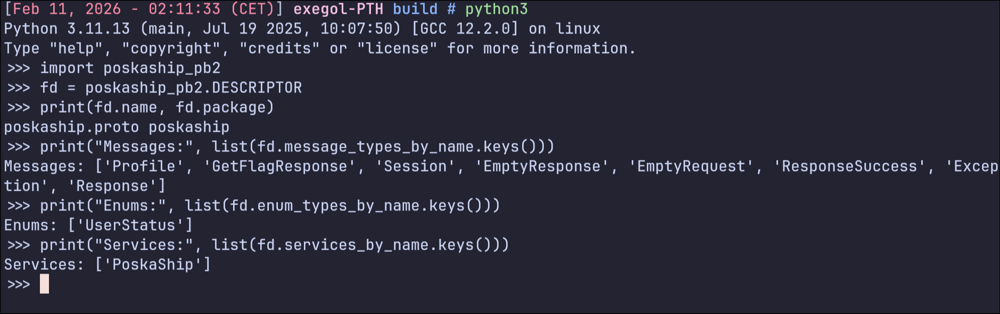

Ensuite on extrait structure d’un message (`Profile` le plus intéressant ici) :

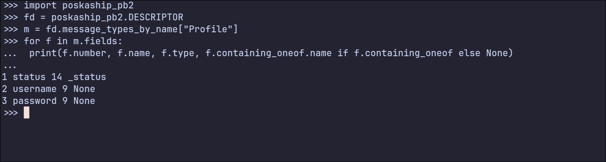

On peut interpréter ça comme :

Donc on peut interpréter ça comme :

```
status : champ n°1 type enum (donc UserStatus)

username : champ n°2 type string

password : champ n°3 type string
```

En listant l'enum `UserStatus` on retrouve directement les valeurs du rôle utilisateur :

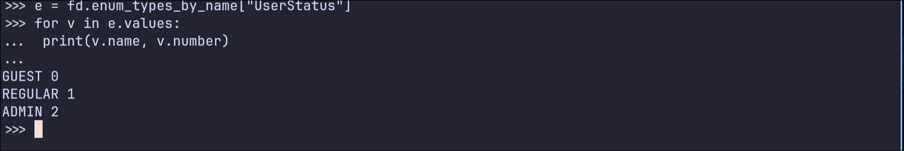

Enfin on extrait les RPC du service PoskaShip :

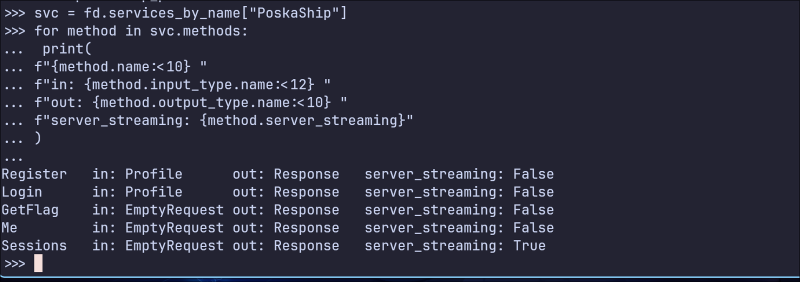